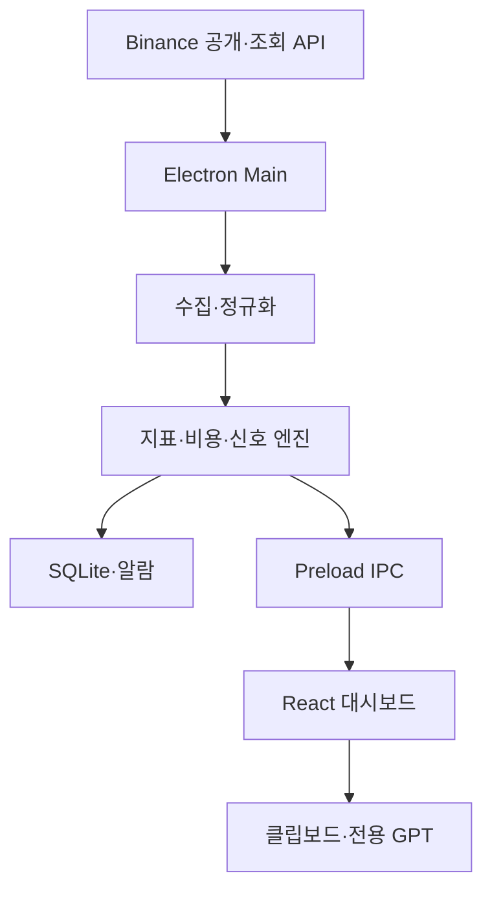

# BTC 선물거래 로컬 프로그램 개발 기획서

> 문서 버전: 1.0  
> 작성일: 2026-07-24  
> 프로젝트 가칭: `btc-futures-assistant`  
> 기준: 이 문서는 현재 대화에서 합의한 내용만 반영한다. 과거 자동매매 기획은 반영하지 않는다.

## 0. 문서 목적

이 문서는 다른 ChatGPT Work 대화창이나 개발자에게 그대로 전달하여 실제 구현을 시작할 수 있는 개발 명세다.

제품의 목표는 바이낸스 BTCUSDT 선물시장을 Windows PC에서 계속 감시하면서 진입 후보, 비용, 위험, 포지션 상태를 계산하고 알람을 주는 것이다. 프로그램이 만든 최신 분석자료는 사용자가 버튼 한 번으로 복사하여 전용 GPT에 붙여 넣는다. 주문은 사용자가 바이낸스에서 직접 실행한다.

이 제품은 자동매매 프로그램이 아니며, 수익 또는 고점·저점 예측의 정확성을 보장하지 않는다.

---

## 1. 확정된 제품 범위

| 항목              | 확정 기준                                    |
| ----------------- | -------------------------------------------- |
| 거래소            | Binance                                      |
| 상품              | USDⓈ-M Futures                               |
| 심볼              | BTCUSDT 무기한 선물만                        |
| 레버리지          | 10배 고정                                    |
| 마진              | 격리마진 기본                                |
| 실행 환경         | Windows 11 로컬 데스크톱                     |
| 시장 감시         | 프로그램 실행 중 상시                        |
| 주문              | 사용자 수동 실행                             |
| 바이낸스 주문 API | 사용하지 않음                                |
| OpenAI API        | 사용하지 않음                                |
| GPT 사용          | 기존 ChatGPT Plus의 전용 GPT를 수동으로 사용 |
| 서버              | 없음                                         |
| DB                | 로컬 SQLite                                  |
| 목표 운영비       | 기존 ChatGPT Plus 구독료를 제외하고 0원      |

### 1.1 MVP에 포함

- BTCUSDT 5분·15분·1시간·4시간 캔들
- 현재가, 마크가격, 거래량, 체결 흐름, 미결제약정, 호가, 펀딩비
- EMA 20·50·200, RSI 14, ATR 14, 세션 VWAP
- 고점·저점, 지지·저항, 돌파·재진입·돌파 실패
- 다중 시간봉 추세 및 진입 후보
- 실제 또는 설정 수수료, 슬리피지, 펀딩비를 포함한 순손익
- 위험기반 주문수량 및 필요 증거금
- 관심·진입·관리·긴급·연결오류 알람
- 선택적 바이낸스 계정 조회
- 현재 포지션과 거래소 보호주문 확인
- GPT 분석자료 복사 및 전용 GPT 열기
- 로컬 거래일지와 신호 이력
- Windows 트레이, 시작프로그램 설정

### 1.2 MVP에서 제외

- 자동 진입·청산·주문 수정
- OpenAI API 자동호출
- 알람 직후 GPT 답변 자동 생성
- PC가 꺼졌을 때 감시
- 클라우드 서버·데이터베이스
- 문자·카카오톡·텔레그램 등 외부 유료 알림
- BTC 이외 심볼
- 검증되지 않은 승률·확률 출력
- 자동 업데이트

---

## 2. 사용 시나리오

### 2.1 신규 진입

1. 앱이 BTCUSDT를 계속 감시한다.
2. 가격이 후보구간에 접근하면 노란 알람을 표시한다.
3. 필수 진입조건이 마감봉 기준으로 충족되면 초록 알람을 표시한다.
4. 사용자가 `GPT 분석자료 복사 + GPT 열기`를 누른다.
5. 앱이 최신 스냅샷을 다시 생성하여 클립보드에 넣고 전용 GPT URL을 연다.
6. 사용자가 `Ctrl+V`, `Enter`를 누른다.
7. GPT가 롱·숏·관망, 진입구간, 손절가, TP1~TP3, 수량, 취소조건을 답한다.
8. 사용자가 바이낸스에서 진입과 거래소 측 보호 손절을 직접 등록한다.

### 2.2 포지션 관리

1. 조회용 계정 연결이 있으면 앱이 현재 포지션을 자동 확인한다.
2. 목표가 접근, 비용 보정 본전가 도달, 구조 훼손, 보호주문 누락을 감지한다.
3. 파란 관리 알람 또는 빨간 긴급 알람을 표시한다.
4. 사용자가 최신 분석자료를 GPT에 전달한다.
5. GPT가 유지·부분익절·손절이동·종료·추가진입 금지를 판단한다.
6. 사용자가 바이낸스에서 직접 실행한다.

### 2.3 계정 API를 연결하지 않은 경우

- 모든 공개 시장 분석과 알람은 정상 동작한다.
- 잔고, 포지션, 실제 수수료, 보호주문은 사용자가 입력한다.
- 해당 값은 화면과 GPT 자료에 `수동입력` 또는 `추정값`으로 표시한다.
- 앱은 입력값이 오래되면 포지션 관리 신뢰도를 낮추고 경고한다.

---

## 3. 권장 기술 스택

| 영역        | 기술                           | 선택 이유                                                |
| ----------- | ------------------------------ | -------------------------------------------------------- |
| 데스크톱    | Electron                       | Windows 알림·트레이·클립보드·외부 URL 열기·자동실행 지원 |
| UI          | React + TypeScript             | 상태가 많은 대시보드에 적합하고 타입으로 오류를 줄임     |
| 빌드        | Vite                           | 빠른 개발 서버와 단순한 프론트 빌드                      |
| 패키징      | Electron Forge                 | Windows 설치파일 제작과 Electron 패키징 표준화           |
| 상태관리    | Zustand                        | 시장·설정·화면 상태를 작고 명시적으로 관리               |
| 런타임 검증 | Zod                            | 바이낸스 응답과 IPC 입력값을 실행 중 검증                |
| 차트        | TradingView Lightweight Charts | 캔들·거래량·라인 표시가 가능하고 TypeScript 지원         |
| DB          | SQLite + `better-sqlite3`      | 로컬 저용량 시계열·거래일지에 충분하고 서버가 필요 없음  |
| 로깅        | Pino                           | 구조화 로그와 민감정보 마스킹                            |
| 단위 테스트 | Vitest                         | 계산 엔진과 규칙 엔진 테스트                             |
| UI 테스트   | React Testing Library          | 주요 패널과 상태 표시 검증                               |
| E2E         | Playwright Electron            | 앱 기동·클립보드·알람 흐름 스모크 테스트                 |
| 코드 품질   | ESLint + Prettier              | 일관된 형식과 정적 검사                                  |

### 3.1 버전 원칙

- 개발 시작 시점의 최신 안정 버전을 사용한다.
- `package-lock.json`을 반드시 커밋한다.
- 주요 버전은 임의 자동상승시키지 않는다.
- Electron과 `better-sqlite3` 호환 여부를 첫 기술검증에서 확인한다.
- 호환이 막히면 DB 인터페이스는 유지하고 SQLite 드라이버만 교체한다.

### 3.2 무료 운영 조건

- 앱은 사용자 PC에서만 실행한다.
- 바이낸스 공개 API는 별도 서버 없이 직접 호출한다.
- GPT 호출은 앱이 하지 않는다.
- GitHub 저장소와 GitHub Actions는 개발 편의를 위한 것이며 앱 운영에는 필요 없다.
- Windows 코드서명 인증서 비용은 MVP에서 제외하므로 설치 시 Windows 경고가 나올 수 있다.

---

## 4. 전체 아키텍처



### 4.1 프로세스 책임

#### Electron Main

- 바이낸스 REST·WebSocket 연결
- API 서명
- 비밀키 암복호화
- 데이터 정규화와 캐시
- 지표·비용·위험·신호 계산
- SQLite 읽기·쓰기
- 알람·트레이·자동실행
- 클립보드 작성과 GPT URL 열기

#### Preload

- 허용된 IPC 함수만 `contextBridge`로 노출
- 임의 채널 호출 금지
- 모든 인자와 반환값을 타입 및 스키마로 검증

#### Renderer

- 대시보드와 설정 UI
- 서버·데이터 상태 표시
- 사용자 입력
- 차트 렌더링
- Main이 계산한 결과 표시

Renderer에는 Node.js, DB, 파일시스템, API Secret 접근권한을 주지 않는다.

### 4.2 핵심 보안 설정

```ts
webPreferences: {
  preload,
  nodeIntegration: false,
  contextIsolation: true,
  sandbox: true
}
```

- 원격 웹페이지를 앱 내부 `webview`로 띄우지 않는다.
- GPT는 기본 브라우저에서 `shell.openExternal()`로 연다.
- CSP를 설정하고 외부 스크립트 로딩을 차단한다.
- 모든 외부 URL은 허용목록으로 검증한다.

---

## 5. 권장 저장소 구조

```text
btc-futures-assistant/
├─ .github/
│  └─ workflows/ci.yml
├─ docs/
│  ├─ PROJECT_SPEC.md
│  ├─ CURRENT_STATE.md
│  ├─ HANDOFF.md
│  ├─ DECISIONS.md
│  └─ SECURITY.md
├─ resources/
│  ├─ icons/
│  └─ sounds/
├─ src/
│  ├─ main/
│  │  ├─ app/
│  │  ├─ binance/
│  │  │  ├─ rest/
│  │  │  ├─ websocket/
│  │  │  ├─ signing/
│  │  │  ├─ schemas/
│  │  │  └─ adapters/
│  │  ├─ market/
│  │  ├─ indicators/
│  │  ├─ structure/
│  │  ├─ costs/
│  │  ├─ risk/
│  │  ├─ signals/
│  │  ├─ positions/
│  │  ├─ alerts/
│  │  ├─ handoff/
│  │  ├─ db/
│  │  ├─ security/
│  │  └─ logging/
│  ├─ preload/
│  ├─ renderer/
│  │  ├─ components/
│  │  ├─ features/
│  │  ├─ charts/
│  │  ├─ stores/
│  │  └─ styles/
│  └─ shared/
│     ├─ types/
│     ├─ schemas/
│     ├─ constants/
│     └─ math/
├─ tests/
│  ├─ fixtures/
│  ├─ unit/
│  ├─ integration/
│  └─ e2e/
├─ migrations/
├─ forge.config.ts
├─ vite.*.config.ts
├─ package.json
├─ package-lock.json
├─ AGENTS.md
└─ README.md
```

### 5.1 의존성 방향

- `shared`는 다른 모듈에 의존하지 않는다.
- 지표·비용·위험·신호 엔진은 Electron이나 UI에 의존하지 않는 순수 TypeScript 함수로 만든다.
- `binance/adapters`가 외부 응답을 내부 타입으로 변환한다.
- UI는 바이낸스 원본 응답을 직접 사용하지 않는다.
- 신호 규칙은 한 파일에 몰아넣지 말고 조건별 함수와 버전 설정으로 분리한다.

---

## 6. 바이낸스 데이터 설계

### 6.1 공개 REST

| 목적        | 엔드포인트                              | 사용 시점               |
| ----------- | --------------------------------------- | ----------------------- |
| 연결 확인   | `GET /fapi/v1/ping`                     | 시작·재연결             |
| 서버시각    | `GET /fapi/v1/time`                     | 시작·주기적 오프셋 갱신 |
| 거래 규칙   | `GET /fapi/v1/exchangeInfo`             | 시작·일 1회             |
| 캔들 초기화 | `GET /fapi/v1/klines`                   | 시작·갭 복구            |
| 마크·펀딩   | `GET /fapi/v1/premiumIndex`             | 시작·WS 복구            |
| 현재 OI     | `GET /fapi/v1/openInterest`             | 시작·보조 갱신          |
| OI 이력     | `GET /futures/data/openInterestHist`    | 시간봉별 변화           |
| 매수·매도량 | `GET /futures/data/takerlongshortRatio` | 5m·15m·1h·4h            |
| 호가 스냅샷 | `GET /fapi/v1/depth`                    | 시작·호가 재동기화      |

### 6.2 공개 WebSocket

2026년 바이낸스의 스트림 경로 분리 기준을 반영한다.

| 경로      | 스트림                  | 용도             |
| --------- | ----------------------- | ---------------- |
| `/market` | `btcusdt@kline_5m`      | 5분 캔들         |
| `/market` | `btcusdt@kline_15m`     | 15분 캔들        |
| `/market` | `btcusdt@kline_1h`      | 1시간 캔들       |
| `/market` | `btcusdt@kline_4h`      | 4시간 캔들       |
| `/market` | `btcusdt@markPrice@1s`  | 마크가격·펀딩    |
| `/market` | `btcusdt@aggTrade`      | 실시간 체결 흐름 |
| `/public` | `btcusdt@depth20@100ms` | 상위 20단계 호가 |

초기 구현은 부분 호가 20단계를 사용한다. 전체 로컬 오더북이 필요해질 때만 REST 스냅샷과 diff depth 시퀀스 `U/u/pu`를 결합한다.

### 6.3 선택적 계정 조회

| 목적             | 엔드포인트                    | 비고                |
| ---------------- | ----------------------------- | ------------------- |
| 잔고·계정        | `GET /fapi/v3/account`        | 서명된 USER_DATA    |
| 현재 포지션      | `GET /fapi/v3/positionRisk`   | BTCUSDT만 요청·필터 |
| 실제 수수료율    | `GET /fapi/v1/commissionRate` | BTCUSDT 지정        |
| 일반 미체결 주문 | `GET /fapi/v1/openOrders`     | BTCUSDT 지정        |
| 조건부 보호주문  | `GET /fapi/v1/openAlgoOrders` | TP/SL·트레일링 확인 |

계정 API가 연결되어도 POST, PUT, DELETE 주문 요청은 구현하지 않는다. 코드 수준에서도 거래 메서드를 만들지 않는다.

### 6.4 User Data Stream

MVP 1차에서는 안전성과 구현 난도를 위해 계정 데이터를 짧은 주기 REST 폴링으로 조회한다.

- 포지션 없음: 15초
- 포지션 있음: 3초
- 앱 포커스 복귀: 즉시
- 네트워크 복구: 즉시

2차 개선에서 User Data Stream을 추가할 수 있다. 추가 시 listen key의 60분 수명과 keepalive, 재연결, REST 재동기화를 구현한다.

### 6.5 정규화 내부 타입

```ts
type Timeframe = '5m' | '15m' | '1h' | '4h';

interface Candle {
  symbol: 'BTCUSDT';
  timeframe: Timeframe;
  openTime: number;
  closeTime: number;
  open: number;
  high: number;
  low: number;
  close: number;
  volumeBase: number;
  volumeQuote: number;
  takerBuyBase: number | null;
  closed: boolean;
}

interface MarketSnapshot {
  schemaVersion: 1;
  capturedAt: number;
  serverTime: number;
  dataAgeMs: number;
  lastPrice: number;
  markPrice: number;
  indexPrice: number;
  fundingRate: number;
  nextFundingAt: number;
  openInterest: number;
  orderBook: OrderBookSummary;
  timeframes: Record<Timeframe, TimeframeAnalysis>;
  freshness: DataFreshness;
}
```

모든 가격과 수량은 외부 응답 단계에서는 문자열로 받은 뒤 정규화 계층에서 유한한 숫자인지 검증한다. `NaN`, 무한대, 음수여서는 안 되는 값은 즉시 거절한다.

---

## 7. 데이터 신뢰성과 장애 처리

### 7.1 신선도 기준

| 데이터          |           정상 |     경고 | 거래판단 차단 |
| --------------- | -------------: | -------: | ------------: |
| 마크가격        |          0~2초 |    2~5초 |      5초 초과 |
| 호가            |          0~1초 |    1~3초 |      3초 초과 |
| 캔들 스트림     |          0~5초 |   5~15초 |     15초 초과 |
| 포지션(보유 중) |          0~5초 |   5~10초 |     10초 초과 |
| OI·비율 통계    | 기대 주기 이내 | 2배 주기 |      3배 주기 |

하나의 핵심 데이터라도 차단 기준을 넘으면 신규 신호는 `DATA_BLOCKED`로 바뀌며 검은 연결오류 알람을 낸다.

### 7.2 재연결

- 지수 백오프: 1초, 2초, 4초, 8초, 15초, 이후 최대 30초
- 10% 무작위 지터 적용
- 연결 회복 후 REST로 최근 캔들과 현재값 재동기화
- 동일 `openTime` 캔들은 upsert
- 누락된 캔들이 있으면 지표와 신호를 다시 계산
- 호가 시퀀스 불일치 시 캐시 폐기 후 재수집

### 7.3 시간 처리

- 내부 저장은 UTC epoch milliseconds
- UI만 Asia/Seoul로 표시
- 바이낸스 서버시각과 로컬시각의 차이를 저장
- 서명 요청에는 보정된 서버시각을 사용
- 일일 손실 기준일은 사용자 설정 시간대의 00:00

---

## 8. 분석 엔진

### 8.1 지표

각 시간봉에 대해 다음을 계산한다.

- EMA 20, 50, 200
- RSI 14
- ATR 14 및 ATR%
- 거래량 SMA 20과 현재 비율
- 세션 VWAP
- 직전 확정 스윙 고점·저점
- 최근 20·50봉 최고·최저
- 고점·저점 구조: HH, HL, LH, LL

초기 데이터 개수는 최소 250개 마감봉으로 한다. EMA 200을 안정적으로 계산할 수 없으면 해당 시간봉은 `INSUFFICIENT_DATA`다.

### 8.2 추세 분류

시간봉별 상태:

- `BULL`: 종가 > EMA20 > EMA50, EMA50 기울기 양수
- `BEAR`: 종가 < EMA20 < EMA50, EMA50 기울기 음수
- `RANGE`: 위 조건이 아니며 ATR 대비 가격압축
- `MIXED`: 방향 조건 충돌
- `UNKNOWN`: 데이터 부족

EMA200은 장기 위치 확인용 필터다. EMA 하나만으로 진입을 결정하지 않는다.

### 8.3 시장구조

- 피벗 후보는 좌우 확정봉이 모두 생긴 뒤 확정한다.
- 미완성 오른쪽 봉을 이용한 피벗 재도색을 금지한다.
- 지지·저항은 피벗 군집과 거래량, 접촉 횟수로 구간화한다.
- 가격 하나가 아니라 `low~high` 구간으로 저장한다.
- 돌파는 마감봉과 거래량 조건으로 확정한다.
- 진행봉 꼬리만 넘은 경우 돌파로 확정하지 않는다.

### 8.4 체결·OI·호가 요약

- 최근 1분·5분 taker buy/sell 비율
- 5m·15m·1h·4h taker buy/sell 통계
- 현재 OI와 5m·15m·1h 변화율
- 상위 5·10·20단계 bid/ask notional
- 호가 불균형
- 목표 수량을 시장가로 체결한다고 가정한 평균 체결가와 슬리피지

호가 불균형은 단독 신호로 쓰지 않고 진입구간의 체결 여건과 추격 위험 판단에만 사용한다.

---

## 9. 비용·손익 엔진

### 9.1 입력값

- 방향: long 또는 short
- 진입 기준가와 예상 체결가
- 청산 목표가 또는 손절가
- 수량
- 진입 주문유형: maker 또는 taker
- 청산 주문유형: maker 또는 taker
- 실제 계정 수수료율 또는 설정 추정치
- 진입·청산 예상 슬리피지
- 보유 중 지나갈 펀딩시각과 펀딩비
- 레버리지 10

### 9.2 선형 USDT 계약 계산

수량을 \(Q\), 진입가를 \(P_e\), 청산가를 \(P_x\)라고 한다.

롱 총손익:

\[
GrossPnL_{long}=Q(P_x-P_e)
\]

숏 총손익:

\[
GrossPnL_{short}=Q(P_e-P_x)
\]

수수료:

\[
Fees=Q P_e f_e + Q P_x f_x
\]

순손익:

\[
NetPnL=GrossPnL-Fees-Slippage-FundingCost
\]

초기 증거금 근사:

\[
InitialMargin=\frac{Q P_e}{10}
\]

증거금 기준 순수익률:

\[
NetROI=\frac{NetPnL}{InitialMargin}\times100
\]

화면에는 다음을 분리 표시한다.

- BTC 가격변동률
- 레버리지 적용 전 총손익
- 비용
- 순손익
- 증거금 기준 순수익률

### 9.3 슬리피지

- 호가 20단계를 순차 소진하여 목표 수량의 가중평균 체결가를 계산한다.
- 호가가 부족하면 `DEPTH_INSUFFICIENT`로 표시한다.
- 시장가 진입 후보는 호가 기반 수치를 사용한다.
- 지정가 후보는 0으로 단정하지 않고 설정된 최소 보수값을 적용할 수 있다.

### 9.4 펀딩

- 다음 펀딩시각 이전 종료 예정이면 예상비용 0
- 펀딩시각을 지날 가능성이 있으면 현재 펀딩비를 추정값으로 포함
- 양의 펀딩비: 롱 지급·숏 수령
- 음의 펀딩비: 숏 지급·롱 수령
- 실제 거래일지는 거래소 내역 또는 사용자 입력 실제값으로 정산

### 9.5 비용 보정 본전가

진입과 예상 청산 비용, 예상 슬리피지, 불리한 펀딩을 모두 회수하는 가격을 수치해석으로 구한다. 단순 `진입가`를 본전가로 표시하지 않는다.

---

## 10. 위험·주문수량 엔진

### 10.1 기본 위험 설정

| 항목                 |                      기본값 |
| -------------------- | --------------------------: |
| 거래당 최대 예상손실 |        선물 계정자산의 0.5% |
| 하루 최대 누적손실   |                        1.5% |
| 연속 손절 제한       |                         3회 |
| 레버리지             |                   10배 고정 |
| 마진 사용 안전계수   | 사용 가능 증거금의 최대 85% |
| 물타기               |                        금지 |

### 10.2 비용 포함 수량

계정자산을 \(E\), 위험률을 \(r\), 진입부터 손절까지 1 BTC당 가격손실과 모든 비용의 합을 \(L_{unit}\)라 한다.

\[
RiskBudget=E \times r
\]

\[
RawQty=\frac{RiskBudget}{L_{unit}}
\]

계산 후 다음 제한을 순서대로 적용한다.

1. `exchangeInfo`의 quantity step size로 내림
2. 최소수량·최소명목 검증
3. 필요 증거금이 사용가능 증거금 × 85% 이하인지 확인
4. 일일 위험한도 확인
5. 예상 청산가와 손절가 사이 안전거리 경고

계정 API가 없으면 사용자가 입력한 선물잔고를 사용하며 `수동입력` 표시를 붙인다.

### 10.3 일일 중단

- 실현 순손익 기준 당일 -1.5% 도달
- 3연속 손절
- 핵심 데이터 장애
- 보호 손절 없는 포지션
- 사용자가 수동 잠금

중단 상태에서는 신호 계산은 계속하되 `진입금지`로 표시하고 초록 진입 알람을 내지 않는다.

---

## 11. 신호 엔진

### 11.1 신호 상태

```ts
type SignalState =
  | 'DATA_BLOCKED'
  | 'RISK_BLOCKED'
  | 'NO_SETUP'
  | 'WATCH_LONG'
  | 'WATCH_SHORT'
  | 'READY_LONG'
  | 'READY_SHORT'
  | 'MANAGE_POSITION'
  | 'EMERGENCY';
```

### 11.2 신규 진입 필수조건

- 핵심 데이터가 신선함
- 일일 위험 잠금이 아님
- 손절가와 무효화 조건이 있음
- 4h와 1h가 진입 방향에 강하게 충돌하지 않음
- 15m 구조 또는 되돌림 setup이 있음
- 마감된 5m trigger가 있음
- 추격진입 제한을 통과
- TP1 비용 차감 후 예상 순수익률 ≥ 2%
- 비용 차감 후 예상 손익비 ≥ 1.7
- 목표까지 예상 가격변동이 총비용의 3배 이상

`순수익률 2%`는 최소 검토기준이며 수익 상한이 아니다.

### 11.3 후보 목표구간

- TP1: 가장 가까운 15m 구조 구간
- TP2: 다음 1h 지지·저항 또는 유동성 구간
- TP3: 4h 확장구간
- 최대 기대구간: 거래량·OI·체결강도가 유지될 때만 조건부 표시

고정 숫자를 먼저 정하고 차트를 끼워 맞추지 않는다. 구조와 ATR로 후보를 만든 뒤 비용·손익비 필터로 제거한다.

### 11.4 부분익절 기본값

- TP1: 40%
- TP2: 30%
- TP3 또는 추적손절: 30%

TP1 후에는 비용 보정 본전가로 손절 이동을 검토한다. 자동으로 주문을 바꾸지 않는다.

### 11.5 신호 등급

초기에는 확률을 사용하지 않는다.

- A: 필수조건 모두 충족, 상위시간봉·거래량·OI가 지지
- B: 필수조건 충족, 보조조건 일부 중립
- C: 관심구간이지만 트리거 또는 비용조건 미충족

등급 옆에 충족조건과 반대근거를 반드시 표시한다.

### 11.6 중복방지 상태기계

- 동일 방향·동일 setup ID는 최초 1회만 진입 알람
- 조건이 해제된 뒤 다시 충족되거나 새 5m 마감봉에서 구조가 갱신되어야 재알림
- 노란 관심 알람 기본 쿨다운 15분
- 초록 진입 알람 기본 쿨다운 5분
- 빨간 긴급 알람은 확인 전 30초마다 반복하되 최대 5회
- 데이터 오류는 연결이 복구되면 자동 해제

---

## 12. 포지션 관리 엔진

### 12.1 조회 항목

- 방향과 포지션 모드
- 수량
- 평균 진입가
- 마크가격
- 거래소 break-even price
- 계산한 비용 보정 본전가
- 평가손익
- 청산가
- 격리 증거금
- 일반 미체결 주문
- 조건부 TP/SL·트레일링 주문

### 12.2 긴급 조건

- 보유 포지션이 있는데 유효한 보호 손절이 없음
- 보호 손절 수량이 현재 포지션보다 작음
- 손절 trigger가 포지션 반대편에 잘못 위치
- 무효화 가격 도달
- 청산가와 현재가의 거리가 설정 안전한도 이하
- 포지션 데이터가 10초 이상 오래됨
- 앱 재시작 후 포지션은 확인됐지만 보호주문 확인 실패

보호주문 상태를 확인할 수 없으면 `없음`으로 단정하지 않고 `미확인`으로 표시하되 빨간 경고를 낸다.

### 12.3 추가진입

- 손실 중 물타기 금지
- 기존 포지션의 최대 손실이 이미 제거된 경우만 검토
- 추가 후 전체 포지션의 손절 기준 최대손실이 새 위험예산 이내
- 새 15m setup과 5m 마감 trigger가 있어야 함
- 결과는 `가능 후보`일 뿐 자동 실행하지 않음

---

## 13. 알람·Windows 동작

| 단계        | 색·소리         | 의미                      |
| ----------- | --------------- | ------------------------- |
| 관심        | 노랑·짧은음 1회 | 후보가격 접근             |
| 진입준비    | 초록·벨 1회     | 필수조건 충족             |
| 관리        | 파랑·알림음 1회 | TP·본전·관리조건          |
| 긴급        | 빨강·반복음     | 손절·무효화·보호주문 문제 |
| 데이터 오류 | 검정·경고음     | 연결·신선도 문제          |

### 13.1 알림 액션

- `상세 보기`
- `GPT 분석자료 복사 + GPT 열기`
- `최신 데이터로 갱신`
- `확인`
- 긴급 알람은 `10분 음소거`를 제공하지 않고 소리만 1분 일시정지 가능

### 13.2 트레이

- 현재 상태 색상
- 마지막 데이터 시각
- 감시 일시정지·재개
- 대시보드 열기
- GPT 분석자료 복사
- 앱 종료

### 13.3 자동실행

- 기본은 꺼짐
- 설정에서 사용자가 명시적으로 켬
- Windows 로그인 시 최소화 상태로 시작
- 시작 후 데이터가 동기화되기 전에는 신호를 내지 않음

---

## 14. 화면 명세

### 14.1 온보딩

1. 제품 한계와 수동주문 원칙 확인
2. BTCUSDT·10배·격리 기본값 확인
3. 선물잔고 수동입력 또는 조회 API 연결 선택
4. 수수료 자동조회 또는 수동입력
5. 전용 GPT URL 입력
6. Windows 알림 테스트
7. 공개 데이터 연결 테스트

### 14.2 메인 대시보드

상단:

- 앱 상태
- 바이낸스 연결
- 데이터 기준시각·나이
- 현재가·마크가격
- 펀딩비·다음 펀딩
- `진입가능 / 대기 / 진입금지`

중앙:

- 5m 차트와 거래량
- 15m·1h·4h 추세 카드
- EMA·RSI·ATR·VWAP
- OI·체결·호가 요약

우측 진입 후보:

- 롱·숏·관망
- 등급
- 진입구간
- 손절·무효화
- TP1·TP2·TP3
- 각 목표의 가격변동률·총 ROI·순 ROI
- 비용과 순 손익비
- 권장 수량·필요 증거금·최대손실

하단:

- 포지션
- 보호주문
- 알람 이력
- GPT 버튼
- 거래일지

### 14.3 설정

- 위험률, 일일 손실한도, 연속손절 제한
- 수수료율과 주문유형
- 슬리피지 보수값
- 알람음·볼륨
- 자동실행
- GPT URL
- API Key·Secret 저장·삭제·연결 테스트
- 데이터 초기화와 로그 내보내기

API Secret은 입력 후 다시 평문으로 보여주지 않는다.

---

## 15. GPT 전달자료 계약

### 15.1 생성 원칙

- 복사 버튼을 누르는 순간 최신 시장·포지션을 다시 확인한다.
- 생성 완료까지 기준시각이 5초를 넘으면 재생성한다.
- 값이 없으면 추측하지 않고 `null`과 사유를 기록한다.
- API Key, Secret, 계정 식별정보, 원본 로그는 포함하지 않는다.
- 사람이 읽기 쉬운 Markdown과 기계적으로 안정적인 JSON 블록을 함께 제공한다.
- 4개 시간봉의 전체 캔들 목록 대신 핵심값과 최근 마감봉 요약을 넣어 토큰을 절약한다.

### 15.2 JSON 스키마 개요

```json
{
  "schemaVersion": 1,
  "requestType": "NEW_ENTRY",
  "capturedAtKst": "2026-07-24T14:30:05+09:00",
  "symbol": "BTCUSDT",
  "contract": "USDT-M-PERP",
  "leverage": 10,
  "marginMode": "ISOLATED",
  "freshness": {},
  "market": {},
  "timeframes": {
    "5m": {},
    "15m": {},
    "1h": {},
    "4h": {}
  },
  "derivatives": {},
  "costs": {},
  "candidate": {},
  "risk": {},
  "position": null,
  "missingFields": [],
  "requiredAnswer": []
}
```

### 15.3 요청유형

- `NEW_ENTRY`
- `ALERT_RECHECK`
- `POSITION_MANAGEMENT`
- `TARGET_RECALCULATION`
- `TRADE_REVIEW`

### 15.4 필수 GPT 응답 요구

신규진입:

- 롱·숏·관망
- A·B·C 등급
- 진입구간
- 손절가·무효화
- TP1·TP2·TP3와 비용 차감 순 ROI
- 권장 수량·필요 증거금·최대손실
- 핵심 근거·반대근거
- 취소조건·재분석조건

포지션관리:

- 유지·부분익절·손절이동·종료
- 현재 순손익
- 비용 보정 본전가
- 부분익절 수량
- 변경 손절가
- 남은 목표구간
- 추가진입 가능 또는 금지
- 긴급 종료조건

---

## 16. 로컬 DB

### 16.1 파일 위치

- Electron `app.getPath('userData')` 아래 앱 전용 하위 폴더
- DB, 비밀정보 암호문, 로그를 서로 분리
- 자동 백업은 하루 1회 최근 7개 유지

### 16.2 주요 테이블

#### `app_settings`

- `key` PK
- `value_json`
- `updated_at`

Secret은 이 테이블에 평문 저장하지 않는다.

#### `candles`

- `symbol`
- `timeframe`
- `open_time`
- OHLCV
- `closed`
- 복합 PK: `symbol, timeframe, open_time`

#### `signals`

- `id`
- `setup_id`
- `rules_version`
- `state`
- `direction`
- `grade`
- `captured_at`
- `market_snapshot_json`
- `candidate_json`
- `blocked_reason`

#### `alerts`

- `id`
- `signal_id`
- `level`
- `created_at`
- `acknowledged_at`
- `repeat_count`

#### `position_snapshots`

- `id`
- `captured_at`
- `source`
- `position_json`
- `protective_orders_json`

#### `gpt_handoffs`

- `id`
- `request_type`
- `created_at`
- `schema_version`
- `payload_text`
- `source_signal_id`

#### `trades`

- `id`
- `opened_at`
- `closed_at`
- `direction`
- `entry_price`
- `exit_price`
- `quantity`
- `gross_pnl`
- `fees`
- `funding`
- `slippage`
- `net_pnl`
- `net_roi`
- `signal_id`
- `gpt_decision`
- `notes`

#### `trade_exits`

- `id`
- `trade_id`
- `executed_at`
- `price`
- `quantity`
- `fee`
- `exit_type`

#### `daily_risk`

- `local_date`
- `starting_equity`
- `realized_net_pnl`
- `loss_streak`
- `locked`
- `lock_reason`

#### `app_events`

- `id`
- `level`
- `event_type`
- `created_at`
- `message`
- `metadata_json`

### 16.3 보존

- 캔들: 계속 보존하되 중복 upsert
- 고빈도 체결 원본: 저장하지 않고 집계만 저장
- 신호·알람·거래: 영구 보존
- 앱 로그: 30일 또는 100MB 중 먼저 도달
- 사용자가 CSV·JSON으로 내보낼 수 있음

---

## 17. IPC 계약

허용할 대표 명령:

```ts
interface DesktopApi {
  getDashboard(): Promise<DashboardViewModel>;
  getSettings(): Promise<PublicSettings>;
  updateSettings(input: UpdateSettingsInput): Promise<void>;
  testPublicConnection(): Promise<ConnectionTestResult>;
  saveBinanceCredentials(input: CredentialsInput): Promise<void>;
  deleteBinanceCredentials(): Promise<void>;
  testAccountConnection(): Promise<AccountConnectionResult>;
  generateGptHandoff(input: HandoffRequest): Promise<HandoffResult>;
  copyAndOpenGpt(input: HandoffRequest): Promise<HandoffResult>;
  acknowledgeAlert(alertId: string): Promise<void>;
  listTrades(query: TradeQuery): Promise<TradePage>;
  saveTrade(input: SaveTradeInput): Promise<Trade>;
  exportJournal(format: 'csv' | 'json'): Promise<string>;
}
```

Main → Renderer 이벤트:

- `dashboard:updated`
- `signal:changed`
- `alert:raised`
- `connection:changed`
- `position:changed`

동적 채널명과 임의 `ipcRenderer.send` 노출을 금지한다.

---

## 18. 비밀정보·보안

### 18.1 바이낸스 키

- 주문·출금 권한을 켜지 않은 조회 목적 키만 사용
- 가능하면 IP 제한 사용
- Secret은 Electron Main에서만 취급
- Electron `safeStorage` 비동기 API로 암호화
- 암호문만 로컬 파일에 저장
- Renderer, IPC 반환, GPT 자료, 로그, 오류 추적에 Secret 금지
- 연결 테스트 로그에도 Key는 앞 4자 외 마스킹

### 18.2 앱 로그 마스킹

다음 키 이름과 패턴은 자동 마스킹한다.

- `apiKey`
- `secret`
- `signature`
- `X-MBX-APIKEY`
- query string의 `signature`

### 18.3 저장소

- `.env`, 로그, DB, 백업, 인증정보 파일을 `.gitignore`
- 예시는 `.env.example`만 커밋
- 실제 키가 커밋된 경우 키를 즉시 폐기하고 새로 발급
- Git 기록에서 문자열만 지운 것으로 안전하다고 간주하지 않음

### 18.4 거래 안전

- 주문 메서드와 주문 권한을 구현하지 않는다.
- 보호 손절은 앱 알람이 아니라 거래소에 사용자가 직접 등록한다.
- 앱이 꺼지거나 GPT가 응답하지 않아도 거래소 손절은 작동해야 한다.
- 데이터 오류 시 진입을 차단하는 쪽으로 실패한다.

---

## 19. 테스트 전략

### 19.1 단위 테스트

필수:

- EMA, RSI, ATR, VWAP 고정 fixture
- 롱·숏 총손익
- maker/taker 혼합 수수료
- 부분익절 다회 수수료
- 양·음 펀딩의 롱·숏 부호
- 비용 보정 본전가
- 호가 소진 슬리피지
- 위험기반 수량과 step size 내림
- TP1 순 ROI 2% 경계
- 순 손익비 1.7 경계
- 일일 -1.5% 잠금
- 3연속 손절 잠금
- 미완성봉이 신규 진입 trigger로 사용되지 않음
- 피벗이 미래 데이터로 재도색되지 않음

### 19.2 통합 테스트

- 저장된 바이낸스 응답 fixture의 Zod 검증
- REST 초기화 → WS 갱신 → 캔들 마감
- WebSocket 끊김 → 백오프 → REST 갭 복구
- 서버시각 보정이 포함된 서명
- 계정 API 거절 시 공개 모드 유지
- 앱 재시작 → DB 마이그레이션 → 상태 복원
- 포지션 존재·보호주문 없음 → 긴급 알람
- 최신 GPT payload의 수치가 대시보드와 일치

### 19.3 E2E

- 앱 최초 실행과 온보딩
- 공개 데이터 연결 실패 UI
- 알림 테스트
- 설정 저장 후 재시작
- GPT payload 클립보드 복사
- 허용된 GPT URL만 외부 열기
- 거래일지 생성·수정·내보내기

### 19.4 수동 QA

- Windows 11 설치·제거
- 시스템 트레이
- 로그인 자동시작
- PC 절전 후 복귀
- 인터넷 끊김·복구
- 바이낸스 점검·429·5xx
- 다중 모니터와 DPI 125%·150%
- 소리 꺼짐 상태와 알림 권한 차단

---

## 20. 완료 기준

MVP는 다음을 모두 만족해야 한다.

- [ ] Windows 11에서 개발모드와 패키징 빌드가 실행됨
- [ ] BTCUSDT 4개 시간봉이 초기화되고 실시간 갱신됨
- [ ] 데이터 나이와 연결오류가 정확히 표시됨
- [ ] 지표 fixture 테스트가 통과함
- [ ] 진입·손절·TP·수량·비용·순 ROI가 계산됨
- [ ] 미완성봉만으로 초록 진입 알람이 발생하지 않음
- [ ] 신호 중복방지가 동작함
- [ ] 조회 API가 없어도 공개 모드가 동작함
- [ ] 조회 API 사용 시 포지션·수수료·보호주문이 표시됨
- [ ] API Secret이 로그·Renderer·GPT payload에 없음
- [ ] 보호 손절 누락 시 긴급 알람이 발생함
- [ ] 버튼 한 번으로 최신 GPT 자료가 복사되고 GPT가 열림
- [ ] 거래일지와 실제 비용을 기록·내보낼 수 있음
- [ ] 앱 코드에 주문 생성·수정·취소 요청이 없음
- [ ] `npm run lint`, `npm run typecheck`, `npm test`, `npm run build` 통과
- [ ] README와 HANDOFF에 재현 가능한 실행방법이 있음

---

## 21. 단계별 개발 계획

### Phase 0 — 골격·기술검증

결과물:

- Electron + React + TypeScript + Vite 실행
- Main/Preload/Renderer 분리
- SQLite native module 패키징 검증
- Windows Notification, Tray, Clipboard, `openExternal` 검증
- CI의 lint·typecheck·unit test

종료조건:

- 개발모드와 Windows 패키징 앱에서 위 기능이 모두 동작

### Phase 1 — 공개 시장 데이터

결과물:

- REST client와 응답 스키마
- WebSocket `/market`, `/public` 연결
- 4개 시간봉·마크가격·호가·OI·펀딩
- 재연결·신선도·갭 복구
- 기본 대시보드

### Phase 2 — 계산 엔진

결과물:

- 지표
- 시장구조
- 체결·OI·호가 요약
- 비용·순손익
- 위험·수량
- 충분한 단위 테스트

### Phase 3 — 신호와 알람

결과물:

- 규칙 버전 1
- 등급과 반대근거
- 중복방지 상태기계
- Windows 알림·소리·트레이
- 일일 위험 잠금

### Phase 4 — 선택적 계정 조회

결과물:

- 안전 저장
- 서명된 GET
- 잔고·포지션·수수료·일반 주문·조건부 주문
- 보호주문 검증과 긴급 알람
- 계정 API 실패 시 공개 모드 fallback

### Phase 5 — GPT 인수인계·거래일지

결과물:

- 버전된 payload 생성기
- 복사 + GPT 열기
- 거래·부분익절·비용 기록
- CSV·JSON 내보내기

### Phase 6 — 모의검증

결과물:

- 자동주문 없는 paper log
- 상승·하락·횡보 구간별 신호 결과
- 실제 비용 포함 성과
- 잘못된 신호와 누락 분석
- 규칙 임계값은 결과 근거가 있을 때만 변경

실거래 전 최소 2~4주 모의 운영을 권장한다.

---

## 22. Git 운영과 인수인계

### 22.1 저장소

권장 이름:

```text
btc-futures-assistant
```

자동매매가 아니므로 저장소 이름에 `autotrader`를 사용하지 않는다.

### 22.2 브랜치

- `main`: 항상 실행·테스트 가능한 상태
- `feat/phase-0-foundation`
- `feat/market-data`
- `feat/calculation-engine`
- `feat/alerts`
- `feat/account-readonly`
- `feat/gpt-handoff-journal`

### 22.3 커밋

예:

```text
feat(market): add BTCUSDT kline stream adapters
feat(costs): calculate fee-adjusted net ROI
fix(alerts): suppress duplicate ready signals
test(risk): cover daily loss lock
docs(handoff): update current implementation status
```

### 22.4 매 작업 종료 시 갱신할 문서

`docs/CURRENT_STATE.md`

- 현재 완료 Phase
- 실제 동작 기능
- 아직 mock인 기능
- 실행 명령
- 테스트 결과

`docs/HANDOFF.md`

- 이번 작업 변경사항
- 중요 파일
- 남은 작업
- 알려진 오류
- 재현 방법

`docs/DECISIONS.md`

- 중요한 기술·거래규칙 결정
- 결정일
- 선택 이유
- 대안과 향후 재검토 조건

### 22.5 이 대화로 돌아올 때 전달할 정보

```text
저장소: https://github.com/<owner>/btc-futures-assistant
브랜치: <branch>
커밋: <full commit SHA>
완료 단계: Phase <n>
실행 명령: <command>
테스트 결과: <result>
확인 요청: <review / debug / next phase implementation>
```

커밋 SHA를 주면 같은 브랜치에 새 커밋이 추가되어도 검토 대상을 정확히 고정할 수 있다.

Private 저장소라면 ChatGPT의 GitHub 연결 계정이 해당 저장소를 읽을 수 있어야 한다. 다른 Work 대화에서 push했다고 이 대화가 자동으로 변경 사실을 알게 되는 것은 아니므로, 돌아와서 저장소 URL·브랜치·커밋 SHA를 알려줘야 한다.

---

## 23. 다른 Work 대화 시작용 프롬프트

아래 내용을 새 대화에 그대로 붙여 넣는다.

```text
새 프로젝트를 개발해줘.

프로젝트명: btc-futures-assistant
환경: Windows 11, Node.js 24, npm, Git, VS Code

첨부한 `BTC_Futures_Local_Program_Development_Spec.md`를 최우선 개발 명세로 사용해.
이 프로젝트는 BTCUSDT 10배 격리 선물을 위한 로컬 반자동 보조 프로그램이며 자동주문은 절대 구현하지 않아.
OpenAI API와 유료 서버도 사용하지 않아.

먼저 Phase 0만 구현해.
1. 새 Git 저장소 골격을 만든다.
2. Electron + React + TypeScript + Vite + Electron Forge를 구성한다.
3. Main/Preload/Renderer 보안 경계를 적용한다.
4. SQLite 패키징 기술검증을 한다.
5. Windows 알림·트레이·클립보드·외부 URL 열기 테스트 화면을 만든다.
6. lint, typecheck, test, build 스크립트를 만든다.
7. README, docs/CURRENT_STATE.md, docs/HANDOFF.md, docs/DECISIONS.md,
   docs/SECURITY.md, AGENTS.md를 작성한다.
8. 모든 검증을 실행하고 결과를 보고한다.

구현 전에 현재 폴더와 기존 파일을 확인하고, 이미 있는 사용자 변경사항은 덮어쓰지 마.
막히지 않는 이상 중간 확인질문 없이 안전한 기본값으로 진행해.
실제 API Key나 Secret을 코드·문서·테스트에 넣지 마.
완료 후 변경 파일, 실행법, 테스트 결과, 남은 위험을 정리해.
GitHub push는 내가 저장소 주소를 제공하거나 명시적으로 요청한 뒤 진행해.
```

Phase 0이 검증된 다음 새 대화에서 `Phase 1을 구현해`라고 진행한다. 한 번에 전체 Phase를 구현하면 데이터 오류와 비용 계산 오류를 찾기 어려우므로 단계별 커밋을 유지한다.

---

## 24. 구현 중 절대 변경하지 않을 원칙

1. BTCUSDT 이외 심볼을 추가하지 않는다.
2. 레버리지는 10배 고정이다.
3. 자동주문을 구현하지 않는다.
4. OpenAI API를 호출하지 않는다.
5. 실시간 데이터가 오래되면 진입 판단을 차단한다.
6. 신규 진입은 마감봉 trigger를 사용한다.
7. 2% 순 ROI는 최소 조건이지 수익 상한이 아니다.
8. 모든 수익과 손익비는 비용 차감 후 수치도 함께 표시한다.
9. 손실 포지션 물타기를 허용하지 않는다.
10. 앱 알람과 GPT는 거래소 보호 손절을 대체하지 않는다.
11. 통계가 쌓이기 전에 임의 승률·확률을 만들지 않는다.
12. 키와 Secret을 GPT, Renderer, 로그, Git에 노출하지 않는다.

---

## 25. 공식 기술 참고자료

- Electron 보안: https://www.electronjs.org/docs/latest/tutorial/security
- Electron safeStorage: https://www.electronjs.org/docs/latest/api/safe-storage
- Electron Forge Windows Squirrel: https://www.electronforge.io/config/makers/squirrel.windows
- Vite: https://vite.dev/guide/
- TradingView Lightweight Charts: https://tradingview.github.io/lightweight-charts/docs
- Binance USDⓈ-M 시장 REST: https://developers.binance.com/en/docs/catalog/core-trading-derivatives-trading-usd-s-m-futures/api/rest-api/market-data
- Binance USDⓈ-M 공개 WebSocket: https://developers.binance.com/en/docs/catalog/core-trading-derivatives-trading-usd-s-m-futures/api/ws-streams/public
- Binance USDⓈ-M 시장 WebSocket: https://developers.binance.com/en/docs/catalog/core-trading-derivatives-trading-usd-s-m-futures/api/ws-streams/market
- Binance USDⓈ-M 계정 REST: https://developers.binance.com/en/docs/catalog/core-trading-derivatives-trading-usd-s-m-futures/api/rest-api/account
- Binance USDⓈ-M 거래조회 REST: https://developers.binance.com/en/docs/catalog/core-trading-derivatives-trading-usd-s-m-futures/api/rest-api/trade
- Binance USDⓈ-M 변경이력: https://developers.binance.com/en/docs/products/derivatives-trading-usds-futures/change-log

바이낸스 API는 변경될 수 있으므로 Phase 1과 Phase 4를 시작할 때 변경이력을 다시 확인한다.
