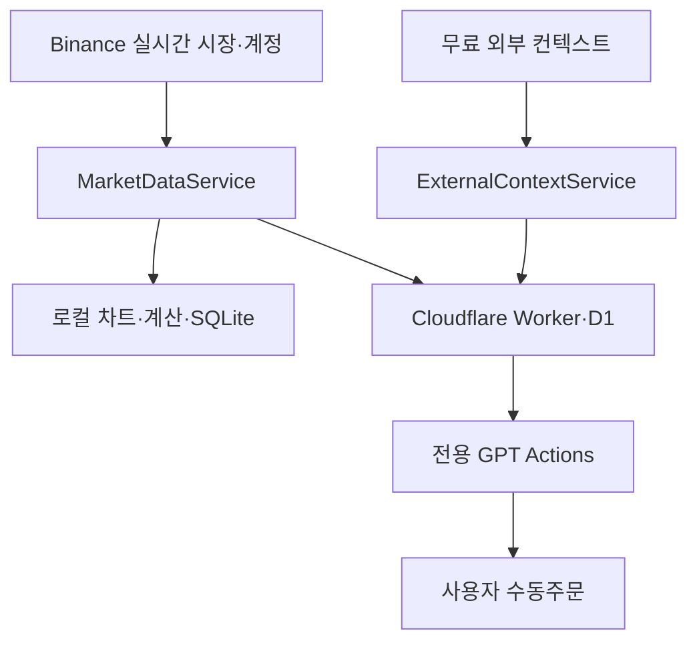
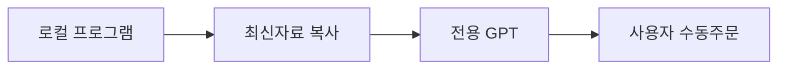

# BTC Futures Assistant 최종 개발 기획서

> 문서 버전: 6.0
> 기준일: 2026-07-29  
> 프로젝트명: `btc-futures-assistant`  
> 저장소: `ckddnjs1173/btcgpt`  
> 대상 환경: Windows 11  
> 문서 지위: 이 문서는 프로젝트의 유일한 기획·개발 기준이다.

---

## 0. 문서 사용 원칙

이 문서는 기존 기획서, 수정안, 현재상태 문서, 결정 기록, 보안 문서와 인수인계 문서를 모두 대체한다.

저장소에 남아 있는 다른 문서·주석·화면 문구·기존 코드가 이 문서와 충돌하면 이 문서를 우선한다. 다만 이미 구현된 안전한 기반 코드는 가능한 한 유지하고 확장한다.

Codex는 사용자가 `기획서 읽고 작업해`라고 요청하면 다음 순서로 행동한다.

1. 이 문서를 처음부터 끝까지 읽는다.
2. 현재 브랜치, Git 상태, `package.json`, 소스코드, 테스트와 최근 커밋을 확인한다.
3. 단계별 완료조건을 기준으로 최초의 미완료 Phase를 판정한다.
4. 해당 Phase에서 안전하게 완료할 수 있는 가장 작은 수직 기능 단위를 구현한다.
5. 기존 사용자 변경사항과 관련 없는 코드를 훼손하지 않는다.
6. 사용자가 별도로 요청하지 않으면 테스트 파일 생성, 단위·통합·E2E·soak 테스트 실행을 하지 않는다. 구현 변경에는 타입 검사·린트·프로덕션 빌드처럼 운영 산출물에 직접 필요한 최소 검증만 수행한다.
7. 실행한 최소 검증이 실패하면 원인을 해결하고 다시 검증한다.
8. 작업 결과, 검증 결과, 남은 작업과 사용자 확인이 필요한 항목을 보고한다.

이 문서를 작업일지로 바꾸거나 임의로 제품 방향을 변경하지 않는다. 제품 범위 변경이 필요하면 구현 전에 사용자에게 이유와 영향을 설명하고 승인을 받는다.

---

## 1. 제품 정의

`BTC Futures Assistant`는 Binance BTCUSDT USDⓈ-M 무기한 선물의 실시간 시장정보와 사용자 포지션을 수집·정규화·계산하여 전용 코인 분석 GPT에 전달하는 Windows 로컬 거래 보조 프로그램이다. 실시간 거래 판단이 제품의 중심이며, 뉴스·거시경제·옵션·온체인·심리 정보는 진입을 대신 결정하지 않고 돌발 위험과 중장기 맥락을 보강하는 보조 컨텍스트로만 사용한다.

최종 사용 흐름은 다음과 같다.

1. 로컬 프로그램이 Binance의 최신 시장정보를 계속 수집한다.
2. 프로그램이 원본 데이터를 검증하고 GPT가 읽기 좋은 최신 스냅샷으로 압축한다.
3. 프로그램이 스냅샷을 인증된 무료 HTTPS 중계소에 주기적으로 갱신한다.
4. 별도 컨텍스트 수집기가 무료 공식·공개 소스의 뉴스·거시경제·옵션·온체인 정보를 낮은 빈도로 갱신한다.
5. 사용자가 전용 GPT에 `지금 분석해줘`, `뉴스 포함 분석해줘`, `내 포지션 봐줘` 또는 `2개월 전망을 정리해줘`라고 요청한다.
6. 전용 GPT가 Actions로 가장 최근 시장 스냅샷을 직접 조회한다.
7. 요청 범위나 위험 플래그에 따라 GPT가 외부 컨텍스트를 추가 조회한다.
8. GPT가 롱·숏·관망, 진입구간, 손절, 무효화 조건, TP1~TP3와 포지션 관리안 또는 조건부 중장기 시나리오를 제시한다.
9. 계산이 필요한 계획은 Actions의 순수 계산 API로 수수료·슬리피지·수량·순손익을 검증한다.
10. 사용자가 Binance 화면에서 주문과 보호주문을 직접 실행한다.

프로그램은 GPT의 실시간 눈과 계산기다. GPT는 시장 분석가다. 사용자는 최종 결정권자이자 주문 실행자다.

---

## 2. 개발 배경과 해결할 문제

사용자는 Binance 차트 이미지를 GPT에 붙여 넣었을 때 유용한 분석 결과를 얻었지만 다음 문제가 있었다.

- 차트를 캡처하고 업로드하는 동안 진입 시점이 지나갔다.
- 여러 시간봉과 시장정보를 매번 직접 정리해야 했다.
- 새 대화에서는 시장 맥락과 포지션 맥락이 사라졌다.
- 캡처에는 펀딩비, 미결제약정, 체결 흐름, 호가와 정확한 비용이 충분히 포함되지 않았다.
- GPT가 보고 있는 자료가 현재 시점의 최신 정보인지 보장하기 어려웠다.

이 제품은 사람이 복사·정리하는 시간을 없애고, 사용자의 요청 순간에 GPT가 최신 데이터를 직접 조회하게 하는 것을 핵심 목표로 한다.

---

## 3. 변경하지 않을 핵심 원칙

1. 거래소는 Binance만 지원한다.
2. 상품은 USDⓈ-M Futures의 `BTCUSDT` 무기한 선물만 지원한다.
3. 기본 실시간 분석은 단타 모드다. `1m`은 진입 타이밍, `5m`은 주 구조, `15m`은 확인, `1h`·`4h`는 상위 배경과 위험 판단에 사용한다. `1d`, `1w`는 마감봉만 사용하는 중장기 참고 시간봉이며 단기 진입 트리거로 사용하지 않는다.
4. 사용자 선택 레버리지는 1~150배이며 미지정 시 기본값은 10배다. 마진 방식은 격리마진만 지원한다.
5. 사용자 전략 기준 마진 방식은 격리마진이다.
6. 프로그램은 자동주문을 실행하지 않는다.
7. Binance 주문 생성·수정·취소 API를 구현하거나 호출하지 않는다.
8. 출금, 자산이체와 레버리지 변경 기능을 구현하지 않는다.
9. 프로그램은 OpenAI API를 호출하지 않는다.
10. GPT 답변을 자동으로 생성하거나 사용자 대신 채팅을 전송하지 않는다.
11. 전용 GPT는 사용자가 질문했을 때만 Actions로 데이터를 조회한다.
12. 프로그램은 객관적인 데이터와 계산값을 제공하며 롱·숏·관망을 결정하지 않는다.
13. GPT가 시장 해석과 포지션 계획을 담당한다.
14. 모든 실제 주문과 보호주문은 사용자가 Binance에서 직접 실행한다.
15. 오래되거나 불완전한 데이터로 신규 거래를 권하지 않는다.
16. 누락값을 추측하거나 이전 값을 최신값으로 위장하지 않는다.
17. 진행 중인 캔들과 마감된 캔들을 명확히 구분한다.
18. 검증되지 않은 승률, 성공확률과 수익보장을 출력하지 않는다.
19. 손실 중인 포지션에 대한 물타기를 기본적으로 권하지 않는다.
20. ChatGPT Plus 구독료 외 추가 운영비 0원을 목표로 한다.
21. 실시간 Binance 수집 경로는 언제나 외부 컨텍스트 수집보다 우선한다.
22. 외부 컨텍스트는 별도 서비스·큐·신선도 상태를 사용하며 실패나 지연이 시장 데이터 분석 게이트를 차단하지 않는다.
23. 자동 수집은 공식 문서화된 공개 API·RSS·WebSocket과 사용자가 발급한 무료 키만 사용한다.
24. 유료 API, 비공식 사설 엔드포인트, 약관을 우회하는 스크래핑을 사용하지 않는다.
25. 뉴스와 장기 자료는 미래 가격을 확정하거나 검증되지 않은 확률을 만드는 근거로 사용하지 않는다.
26. 기본 실시간 분석에서 뉴스는 방향 결정기가 아니라 급변·이벤트 위험 필터다.
27. 상위 시간봉이 반대라는 이유만으로 정상적인 1m·5m 단타 구조를 자동 차단하지 않는다.
28. 프로그램은 단타 판단에 필요한 객관적 구조를 계산하지만 LONG·SHORT·진입 신호·셋업 점수를 만들지 않는다.
29. 진행 중인 1m·5m 캔들은 타이밍 자료로 제공하되 마감 확인 자료와 명확히 구분한다.
30. GPT는 단기 방향과 현재 행동을 분리해 판단하며, WAIT일 때도 객관적인 재분석 촉발 조건을 제시한다.

---

## 4. 역할과 책임

### 4.1 프로그램

프로그램은 다음을 담당한다.

- Binance 공개 REST·WebSocket 데이터 수집
- 선택적 Binance 계정 읽기 전용 조회
- 런타임 스키마 검증과 내부 형식 정규화
- 데이터별 기준시각·수신시각·신선도 관리
- 캔들 누락 복구와 재연결
- 실시간 차트 표시
- 객관적 지표 계산
- 수수료·슬리피지·펀딩·손익·수량 계산
- 수동 또는 자동조회 포지션 표시
- GPT 전달용 스냅샷 생성
- 클립보드 전달 방식 제공
- 최종 연동용 HTTPS 중계소 업로드
- 실시간 경로와 분리된 외부 컨텍스트 수집·정규화·중복 제거
- 중계소가 시장 조회 응답에 결합할 2KB 이하 `riskContext` 요약 생성
- 연결과 데이터 오류 표시

프로그램은 다음을 결정하지 않는다.

- 롱·숏·관망
- 추세의 최종 해석
- 진입 적합 여부
- 추천 진입가
- 추천 손절가
- 추천 목표가
- 포지션 유지·부분익절·종료
- 매매 성공확률

### 4.2 전용 GPT

GPT는 요청할 때마다 최신 스냅샷을 조회한 후 다음을 담당한다.

- 시장 국면과 시간봉 관계 해석
- 롱·숏·관망 중 하나 선택
- 판단 근거와 반대 근거
- 진입 후보구간
- 손절가와 거래 무효화 조건
- TP1·TP2·TP3
- 예상 위험보상비
- 현재 포지션 유지·부분익절·종료 판단
- 손절 이동 여부
- 조건부 추가진입 가능 여부
- 거래 취소조건과 반대 시나리오
- 충돌하는 데이터와 주요 위험요인 설명
- 뉴스·거시경제·옵션·온체인 자료의 출처·시각·신뢰등급을 구분한 해석
- 30~90일 전망 요청 시 상승·하락·무효화 조건을 가진 시나리오 작성

### 4.3 사용자

사용자는 다음을 담당한다.

- 전용 GPT에 분석을 요청
- GPT 계획을 참고해 최종 거래 여부 결정
- Binance에서 직접 진입·청산·보호주문 실행
- 수동 모드에서는 포지션 정보를 프로그램에 입력
- 계정 조회 모드에서는 읽기 전용 인증정보를 안전하게 설정
- 수수료·슬리피지·최대 손실 등 개인 설정 관리

---

## 5. 확정 제품 범위

| 항목 | 기준 |
| --- | --- |
| 앱 이름 | BTC Futures Assistant |
| 패키지 이름 | `btc-futures-assistant` |
| 실행 환경 | Windows 11 로컬 데스크톱 |
| 거래소 | Binance |
| 시장 | USDⓈ-M Futures |
| 심볼 | BTCUSDT 무기한 선물 |
| 단타 핵심 시간봉 | 1m, 5m |
| 확인 시간봉 | 15m |
| 상위 배경 시간봉 | 1h, 4h |
| 참고 시간봉 | 1d, 1w 마감봉 |
| 레버리지 기준 | 사용자 선택 1~150x, 기본 10x |
| 마진 기준 | Isolated |
| 시장 데이터 | Binance 공개 REST·WebSocket |
| 외부 컨텍스트 | 무료 공식·공개 뉴스, 거시경제, 옵션, 온체인, 심리 지표 |
| 계정 데이터 | 수동입력 + 선택적 읽기 전용 조회 |
| 로컬 DB | SQLite |
| AI 연동 | Custom GPT Actions |
| 중계소 | Cloudflare Workers + D1 무료 플랜 |
| 보조 연동 | 클립보드 복사 + 전용 GPT 열기 |
| 주문 | 사용자 수동주문만 허용 |
| OpenAI API | 사용하지 않음 |
| 목표 추가비용 | 0원 |

---

## 6. 사용자 시나리오

### 6.1 신규 진입 분석

1. 사용자가 프로그램을 실행한다.
2. 프로그램이 Binance 서버시각과 상품정보를 동기화한다.
3. 네 시간봉의 마감 캔들을 불러오고 WebSocket을 연결한다.
4. 프로그램이 최신 시장 스냅샷을 5초마다 중계소에 갱신한다.
5. 사용자가 전용 GPT에서 `지금 진입 가능한지 분석해줘`라고 요청한다.
6. GPT가 최신 스냅샷을 Actions로 조회한다.
7. 데이터가 정상일 때만 시장을 해석한다.
8. 거래 계획이 있으면 계산 API로 수수료·슬리피지·수량·순ROI를 검증한다.
9. GPT가 롱·숏·관망과 구체적인 계획을 답한다.
10. 사용자가 Binance에서 직접 실행한다.

### 6.2 보유 포지션 관리

1. 프로그램이 읽기 전용 API로 현재 포지션을 조회하거나 사용자가 수동으로 입력한다.
2. 프로그램이 시장정보와 포지션정보를 동일 스냅샷에 포함한다.
3. 사용자가 GPT에 `내 포지션 유지할지 봐줘`라고 요청한다.
4. GPT가 최신 시장과 포지션을 함께 조회한다.
5. GPT가 유지·부분익절·손절 이동·종료 중 적절한 행동과 조건을 제시한다.
6. 사용자가 거래소에서 직접 실행한다.

### 6.3 중계소 또는 인터넷 장애

1. 프로그램은 로컬 차트와 상태 표시를 계속 유지한다.
2. 업로드 실패를 화면에 표시하고 재시도한다.
3. GPT가 마지막 스냅샷을 조회하더라도 유효시간을 넘겼으면 분석을 중단한다.
4. 사용자는 `최신 분석자료 복사 + GPT 열기` 방식으로 전환할 수 있다.
5. 복사된 자료에도 동일한 신선도 경고가 포함된다.

### 6.4 프로그램이 꺼져 있는 경우

- 중계소는 마지막 스냅샷을 임의로 최신 처리하지 않는다.
- GPT는 스냅샷 생성시각이 기준을 넘으면 거래 분석을 거절한다.
- 사용자에게 프로그램 실행과 연결 복구를 안내한다.

### 6.5 뉴스 포함 실시간 분석

1. GPT는 먼저 최신 시장 스냅샷을 조회한다.
2. `riskContext`가 고위험 이벤트를 표시하거나 사용자가 뉴스를 명시하면 `getExternalContext`를 `INTRADAY`로 호출한다.
3. 게시시각·수집시각·출처·신뢰등급을 확인하고 중복 보도를 하나의 사건으로 묶어 해석한다.
4. 외부 컨텍스트가 오래됐거나 일부 소스가 실패했으면 시장 분석은 계속하되 뉴스 근거의 한계를 명시한다.
5. 뉴스만으로 진입 방향을 뒤집거나 가격을 확정하지 않는다.

### 6.6 30~90일 전망

1. GPT는 최신 시장 스냅샷의 `1d`, `1w` 마감봉과 `getExternalContext(MACRO)`를 함께 조회한다.
2. 거시 일정, 규제, 옵션 변동성, 온체인 상태와 장기 기술 구조를 분리해 정리한다.
3. 단일 목표가를 예언하지 않고 상승·중립·하락 시나리오, 촉발 조건과 무효화 조건을 제시한다.
4. 검증된 통계가 없으면 확률이나 적중률을 붙이지 않는다.
5. 장기 전망을 현재 단기 진입 신호로 자동 변환하지 않는다.

### 6.7 기본 단타 분석

1. 사용자가 `지금 분석해줘`, `자리 봐줘`, `진입 가능?`이라고 요청하면 GPT는 기본적으로 단타 모드로 해석한다.
2. GPT는 최신 snapshot의 `1m`·`5m` 진행봉과 마감봉, 초단기 체결, 호가 변화와 OI 변화를 먼저 확인한다.
3. `15m`은 단타 구조 확인, `1h`·`4h`는 추세 배경과 반대 방향 위험을 설명하는 데 사용한다.
4. GPT는 `단기 방향(LONG_BIAS·SHORT_BIAS·NEUTRAL)`과 `현재 행동(ENTER_NOW·WAIT_TRIGGER·NO_TRADE)`을 분리한다.
5. 상위 시간봉과 반대인 단타는 자동 거절하지 않고 counter-trend로 표시하며 무효화 조건과 목표 범위를 보수적으로 해석한다.
6. `WAIT_TRIGGER`이면 막연히 관망으로 끝내지 않고 롱·숏 재분석 촉발 가격과 체결·호가·OI 확인 조건을 제시한다.
7. `ENTER_NOW` 또는 구체적 조건부 거래 계획을 제시할 때만 계산 API로 수량·비용·최대손실을 검증한다.
8. 진행봉은 진입 타이밍에 사용할 수 있지만 마감봉 확인과 혼동하지 않는다.

---

## 7. 전체 아키텍처

### 7.1 최종 구조



### 7.2 복사 방식

직접 연동이 완성된 뒤에도 장애 대응용으로 유지한다.



### 7.3 데이터 흐름

1. Binance REST 초기화
2. Binance WebSocket 실시간 갱신
3. 외부 컨텍스트는 별도 주기와 연결에서 병렬 수집
4. 모든 외부 응답의 런타임 검증
5. 내부 도메인 타입으로 정규화
6. 시장 데이터는 메모리 캐시와 SQLite 반영
7. 객관적 지표·비용 계산
8. 시장 데이터 신선도와 외부 컨텍스트 신선도를 독립 판정
9. 시장 스냅샷과 외부 컨텍스트 생성
10. 로컬 UI·클립보드·중계소가 동일 시장 스냅샷 사용
11. Worker가 최신 외부 위험 요약을 시장 응답에 결합
12. GPT Action 조회

화면용 값, 클립보드용 값과 Action용 값은 각각 다시 계산하지 않는다. 하나의 검증된 스냅샷을 여러 출력 경로가 공유한다.

---

## 8. 기술 기준

현재 저장소에 구현된 Electron 기반 Phase 0 구조를 유지한다.

| 영역 | 기준 기술 |
| --- | --- |
| 데스크톱 | Electron |
| UI | React + TypeScript |
| 빌드 | Vite |
| 패키징 | Electron Forge |
| 런타임 검증 | Zod |
| 로컬 DB | Node `node:sqlite` |
| 로깅 | Pino |
| 차트 | TradingView Lightweight Charts |
| 단위·통합 테스트 | Vitest |
| UI 테스트 | React Testing Library |
| E2E | Playwright Electron |
| 중계소 | Cloudflare Workers |
| 중계 저장소 | Cloudflare D1 |
| 중계 배포 | Wrangler |
| GPT 연동 계약 | OpenAPI 3.1 |

의존성 버전은 기존 잠금파일과 현재 호환성을 우선한다. 기능과 관계없는 대규모 버전 업그레이드는 하지 않는다.

---

## 9. Electron 보안 경계

### 9.1 Electron Main

다음을 Main에서만 처리한다.

- Binance REST·WebSocket 연결
- 시장 경로와 격리된 외부 컨텍스트 REST·RSS·WebSocket 연결
- 계정 API 서명
- 데이터 검증·정규화
- 메모리 캐시와 SQLite
- 지표·비용 계산
- 스냅샷 생성·업로드
- Secret 저장과 복호화
- 클립보드
- 허용된 외부 URL 열기
- 트레이와 자동실행
- 로그

### 9.2 Preload

Renderer에는 업무 단위의 명시적 메서드만 노출한다.

- 상태 스냅샷 조회
- 실시간 상태 구독
- 설정 조회·저장
- 수동 포지션 조회·저장
- GPT 자료 생성·복사
- GPT 열기
- Binance 연결 테스트
- 중계소 연결 테스트

Raw `ipcRenderer`, 임의 채널 호출과 Node API를 노출하지 않는다.

### 9.3 Renderer

Renderer는 표시와 입력만 담당한다.

- 차트와 시장 카드
- 한 개의 압축된 외부 위험 카드
- 연결·신선도 상태
- 수동 포지션
- 계산기
- GPT 연동 상태
- 설정

Renderer는 파일시스템, SQLite, `shell`, Binance 클라이언트, API Secret과 중계소 Secret에 직접 접근하지 않는다.

### 9.4 필수 BrowserWindow 설정

```ts
{
  nodeIntegration: false,
  contextIsolation: true,
  sandbox: true
}
```

추가 기준:

- CSP 적용
- 팝업 차단
- 앱 내부 임의 탐색 차단
- 외부 URL allowlist
- 원격 스크립트 실행 금지
- 모든 IPC 입력·출력 스키마 검증

---

## 10. Binance 시장 데이터

### 10.1 원칙

`바이낸스의 모든 정보`는 모든 원본 체결과 전체 호가를 GPT에 무제한 전달한다는 의미가 아니다.

프로그램은 분석 가치가 있는 BTCUSDT 시장정보를 충분히 수집하되, 고빈도 원본은 로컬에서 요약하고 GPT에는 현재 판단에 필요한 스냅샷만 제공한다. 이 방식으로 지연, 데이터 크기와 GPT의 정보 과부하를 방지한다.

공식 API 스키마가 변경될 수 있으므로 구현 시 Binance 공식 문서를 다시 확인한다. 외부 응답을 내부 타입으로 직접 사용하지 않는다.

### 10.2 공개 REST

최소 수집 대상:

| 목적 | Binance API |
| --- | --- |
| 연결 확인 | `/fapi/v1/ping` |
| 서버시각 | `/fapi/v1/time` |
| 상품·정밀도·필터 | `/fapi/v1/exchangeInfo` |
| 초기·복구 캔들 | `/fapi/v1/klines` |
| 마크·지수·펀딩 | `/fapi/v1/premiumIndex` |
| 펀딩 이력 | `/fapi/v1/fundingRate` |
| 현재 미결제약정 | `/fapi/v1/openInterest` |
| OI 통계 | `/futures/data/openInterestHist` |
| Taker 매수·매도 통계 | `/futures/data/takerlongshortRatio` |
| 전체 롱·숏 계정 비율 | `/futures/data/globalLongShortAccountRatio` |
| 상위 트레이더 계정 비율 | `/futures/data/topLongShortAccountRatio` |
| 상위 트레이더 포지션 비율 | `/futures/data/topLongShortPositionRatio` |
| 호가 초기화·확인 | `/fapi/v1/depth` |
| 24시간 통계 | `/fapi/v1/ticker/24hr` |

초기 캔들은 각 시간봉별 최소 250개의 마감봉을 확보한다. 진행 중인 캔들은 별도 객체로 관리한다.

폴링 기본값:

| 데이터 | 기본 주기 |
| --- | ---: |
| 서버시각 | 시작 시, 이후 30분 |
| exchangeInfo | 시작 시, 이후 24시간 |
| 현재 OI | 15초 |
| OI 통계 | 5분봉 확정 직후 |
| 롱·숏 비율 | 5분봉 확정 직후 |
| 24시간 통계 | 60초 |
| 펀딩 이력 | 시작 시와 펀딩 직후 |

실제 요청 주기는 Binance의 현재 요청 가중치와 응답 헤더를 존중해 조정한다.

### 10.3 공개 WebSocket

최소 실시간 스트림:

- `btcusdt@aggTrade`
- `btcusdt@markPrice@1s`
- `btcusdt@kline_1m`
- `btcusdt@kline_5m`
- `btcusdt@kline_15m`
- `btcusdt@kline_1h`
- `btcusdt@kline_4h`
- `btcusdt@bookTicker`
- `btcusdt@depth20@100ms`
- `btcusdt@forceOrder`

공식 스트림 경로와 이벤트 스키마는 구현 시점 문서를 기준으로 한다.

### 10.4 정규화 항목

#### 현재 시장

- last price
- mark price
- index price
- best bid·ask와 spread
- 24시간 가격 변화
- 24시간 고가·저가
- 24시간 거래량
- 현재 funding rate
- 다음 funding 시각
- basis와 basis 비율

#### 시간봉

- open time
- close time
- open
- high
- low
- close
- volume
- quote volume
- trade count
- taker buy base volume
- taker buy quote volume
- `isClosed`

#### 체결 흐름

롤링 구간 `15s`, `30s`, `1m`, `3m`, `5m`, `15m`, `1h`별:

- taker buy volume
- taker sell volume
- buy ratio
- sell ratio
- delta
- cumulative delta
- trade count
- 평균 체결 크기
- 초당 체결 건수와 초당 체결금액
- 직전 동일 구간 대비 delta 변화
- 매수·매도 체결 건수

#### 호가

- best bid·ask
- spread와 spread bps
- 상위 5·10·20단계 bid notional
- 상위 5·10·20단계 ask notional
- 단계별 imbalance
- 예상 주문금액별 평균 체결가와 slippage
- 5초·30초 imbalance 변화
- 5초 bid 우세 비율
- 상위 20단계 최대 bid·ask wall 가격과 notional
- 현재 최대 wall의 5초 유지 비율

#### 미결제약정·심리

- current OI
- OI notional
- OI 변화율: 로컬 실시간 표본 기준 1m·5m, 공식 통계 기준 5m·15m·1h·4h
- global long/short account ratio
- top trader account ratio
- top trader position ratio
- taker buy/sell ratio

#### 청산

롤링 구간 `1m`, `5m`, `15m`, `1h`별:

- long liquidation notional
- short liquidation notional
- 순청산 차이
- 최근 주요 청산 이벤트

청산 이벤트가 없다는 것은 정상일 수 있다. 이벤트 부재를 연결 중단으로 판단하지 않고 WebSocket 연결 상태를 별도로 관리한다.

### 10.5 단타용 객관 데이터

단타용 데이터는 방향 신호가 아니라 GPT가 차트 캡처에서 보던 형태와 속도를 재구성할 수 있는 객관적 사실이다.

- 1m 마감봉 최소 250개와 진행봉
- 5m 진행봉과 마감봉
- 진행률, 몸통·윗꼬리·아랫꼬리 비율과 종가 위치
- EMA20의 최근 기울기
- VWAP 이격 bps
- ATR 대비 pivot high·low 거리
- 최근 5봉 범위와 직전 20봉 범위의 압축비
- 거래량 z-score와 진행봉 거래량 비율
- pivot high·low 상·하단 위치 여부
- 15초·30초·1분·3분·5분 order flow
- depth imbalance의 5초·30초 변화와 wall 유지
- 로컬 표본 기반 1분·5분 OI 변화

이 필드는 `scalpContext`로 묶어 snapshot에 포함한다. `scalpContext`는 `bias`, `signal`, `recommendedSide`, `entry`, `stop`, `target` 같은 프로그램 판단 필드를 포함하지 않는다.

### 10.6 중장기 참고 캔들

- `1d`, `1w`는 Binance REST에서 마감봉만 수집한다.
- 앱 시작 시와 새 마감봉이 확정된 뒤에만 갱신한다.
- 진행 중인 일봉·주봉은 장기 시나리오의 확정 근거로 사용하지 않는다.
- 1d·1w 누락은 단기 시장 분석 게이트를 차단하지 않지만 장기 전망 응답에는 `INSUFFICIENT_DATA`로 표시한다.
- 장기 참고 캔들은 실시간 WebSocket 채널 수를 늘리지 않는다.

---

## 11. 데이터 신뢰성

### 11.1 시간

- 내부 기준시각은 UTC epoch milliseconds다.
- 화면에는 KST를 함께 표시할 수 있다.
- 이벤트 시각, Binance 거래 시각, 로컬 수신 시각을 분리한다.
- 서버시각 차이를 측정하고 signed API에 보정값을 사용한다.
- 시스템 시각이 크게 어긋나면 계정 조회와 GPT 분석을 제한한다.

### 11.2 데이터 상태

```ts
type DataStatus =
  | 'INITIALIZING'
  | 'NORMAL'
  | 'DELAYED'
  | 'STALE'
  | 'DISCONNECTED'
  | 'INSUFFICIENT_DATA';
```

전체 스냅샷에는 다음 값이 반드시 있어야 한다.

```ts
type AnalysisGate = {
  analysisAllowed: boolean;
  overallStatus: DataStatus;
  generatedAt: number;
  publishedAt: number | null;
  ageMs: number;
  reasons: string[];
  missingFields: string[];
};
```

### 11.3 신선도 기준

기본값:

| 데이터 | 정상 | 지연 | 분석 금지 |
| --- | ---: | ---: | ---: |
| 마크가격 | 0~2초 | 2~5초 | 5초 초과 |
| 최우선 호가·depth | 0~1초 | 1~3초 | 3초 초과 |
| 캔들 스트림 | 0~5초 | 5~15초 | 15초 초과 |
| 체결 스트림 | 0~3초 | 3~10초 | 10초 초과 |
| 현재 OI | 0~30초 | 30~90초 | 90초 초과 |
| OI·비율 통계 | 기대 주기 이내 | 기대 주기 2배 | 기대 주기 3배 초과 |
| 중계 스냅샷 | 0~8초 | 8~15초 | 15초 초과 |

핵심 데이터가 분석 금지 기준을 넘거나 초기 동기화가 끝나지 않았으면 `analysisAllowed=false`로 설정한다.

GPT는 `analysisAllowed=false`인 경우 신규 진입 방향·가격·수량을 제안하지 않는다. 현재 포지션이 있으면 최신 데이터가 부족하다는 사실과 거래소의 기존 보호주문을 확인하라는 안내만 제공한다.

### 11.4 캔들 일관성

- 마감봉과 진행봉을 별도 저장한다.
- 동일한 open time은 upsert한다.
- WebSocket 재연결 뒤 REST 캔들과 대조한다.
- 누락 open time을 발견하면 REST로 복구한다.
- 복구가 끝날 때까지 해당 시간봉 지표를 신뢰하지 않는다.
- EMA 200 등 필요한 표본이 부족하면 `null`과 `INSUFFICIENT_DATA`를 사용한다.

### 11.5 재연결

- 지수 백오프
- 무작위 지터
- 연결별 최대 재시도 간격
- 명시적인 연결 상태
- 연결 복구 후 REST 재동기화
- 중복 이벤트 제거
- 구독 복원
- 장시간 연결에 대비한 계획적 재연결

### 11.6 숫자 처리

- Binance 숫자 문자열은 파싱 전 검증한다.
- 금액 계산은 부동소수점 오차를 통제한다.
- 상품의 tick size, step size와 min notional을 `exchangeInfo`에서 적용한다.
- 화면 표시용 반올림값으로 내부 계산하지 않는다.
- 원본 단위와 표시 단위를 분리한다.

### 11.7 외부 컨텍스트 상태

- 외부 소스는 시장 데이터와 별도의 `ContextStatus`와 `sourceHealth`를 가진다.
- 하나의 소스가 실패해도 다른 소스와 Binance 시장 수집은 계속된다.
- 외부 컨텍스트가 오래됐다는 이유만으로 `analysisGate.analysisAllowed`를 false로 바꾸지 않는다.
- 다만 GPT는 오래된 외부 정보로 뉴스 기반 단정을 하지 않고 최신 확인이 불가능하다고 명시한다.
- 게시시각과 수집시각을 분리하며 미래 시각, 비정상 URL, 지나치게 긴 본문과 중복 항목을 거부한다.

---

## 12. 객관적 지표

각 시간봉별로 다음을 계산한다.

- EMA 20
- EMA 50
- EMA 200
- RSI 14
- ATR 14
- ATR percent
- 거래량 SMA 20
- 현재 거래량 비율
- 세션 VWAP
- 최근 20봉 최고·최저
- 최근 50봉 최고·최저
- 최근 확정 pivot high·low
- 최근 수익률: 1봉·3봉·12봉
- realized volatility

지표 계산 규칙:

- 신규 분석의 확정 지표는 마감봉 기준이다.
- 진행 중인 캔들 기반 지표는 `live`로 별도 표시한다.
- 외부 라이브러리와 고정 fixture로 결과를 교차검증한다.
- 지표 값으로 프로그램이 매수·매도 신호를 생성하지 않는다.
- `EMA 정배열`, `과매수` 같은 해석 레이블을 핵심 도메인 로직으로 만들지 않는다.
- `1d`, `1w`는 마감봉 기준 EMA·RSI·ATR·최근 고저점처럼 장기 맥락에 필요한 최소 지표만 계산한다.

---

## 13. 포지션과 비용 계산

### 13.1 포지션 입력

계정 조회 전에는 수동입력을 지원한다.

- source: `MANUAL | BINANCE | NONE`
- side: `LONG | SHORT | FLAT`
- entry price
- quantity BTC
- notional USDT
- isolated margin
- leverage
- mark price
- liquidation price
- stop price
- target prices
- entry order type
- planned exit order type
- opened at
- updated at

수동입력은 명확히 표시하고 마지막 수정시각이 오래되면 경고한다.

### 13.2 개인 계산 설정

- maker fee rate
- taker fee rate
- 예상 entry slippage bps
- 예상 exit slippage bps
- 최대 허용 손실 USDT 또는 계정 대비 비율
- 최소 비용 차감 증거금 ROI: 기본 2%
- 부분익절 비율

수수료율은 사용자 등급과 할인에 따라 달라질 수 있으므로 임의의 고정값을 사실처럼 사용하지 않는다. 계정 API 연결 전에는 사용자가 입력한다.

### 13.3 선형 USDT 계약 계산

수량 `q`, 진입가 `Pe`, 청산가 `Px`일 때:

```text
notionalEntry = abs(q) × Pe
notionalExit  = abs(q) × Px

grossPnlLong  = q × (Px - Pe)
grossPnlShort = abs(q) × (Pe - Px)

entryFee = notionalEntry × entryFeeRate
exitFee  = notionalExit × exitFeeRate
```

슬리피지는 가능하면 현재 호가를 걸어 계산하고, 호가 깊이가 부족하면 설정된 bps 추정값과 `ESTIMATED` 표시를 사용한다.

```text
netPnl =
  grossPnl
  - entryFee
  - exitFee
  - entrySlippageCost
  - exitSlippageCost
  - signedFundingPayment

netMarginRoiPercent = netPnl / isolatedMargin × 100
```

펀딩은 방향, 적용 시각과 예상 보유기간에 따라 부호를 구분한다. 실제 지급 전 값은 `ESTIMATED`로 표시한다.

### 13.4 비용 보정 본전가

진입 수수료, 예상 청산 수수료와 슬리피지를 포함해 순손익이 0이 되는 가격을 계산한다. 예상 펀딩을 포함했는지도 함께 표시한다.

### 13.5 위험 기반 수량 검증

GPT가 제시한 진입가와 손절가를 프로그램 계산식으로 검증한다.

```text
maxLoss =
  accountEquity × riskPercent
  또는 사용자가 입력한 maxLossUsdt

riskPerBtc =
  abs(entryPrice - stopPrice)
  + estimatedFeesPerBtc
  + estimatedSlippagePerBtc

rawQuantity = maxLoss / riskPerBtc
```

이후 다음 제약을 적용한다.

- 사용자가 `MAX_LOSS_USDT` 규모 지정을 선택한 경우에만 계산된 수량에 Binance step size 내림 적용
- min quantity
- min notional
- 사용 가능 증거금
- 사용자 선택 1~150배 레버리지와 Binance 실제 허용 레버리지·명목가치 구간
- 격리마진 기준
- 예상 최대 손실 상한

규모 지정 방식은 `MARGIN_USDT`, `QUANTITY_BTC`, `NOTIONAL_USDT`, `MAX_LOSS_USDT` 중 하나다. 사용자가 증거금·BTC 수량·명목가치를 직접 지정한 경우 프로그램은 해당 값을 반올림하거나 자동 변경하지 않고, Binance step size·min quantity·min notional·레버리지 bracket·사용 가능 증거금·최대 손실 조건을 검증해 허용 또는 차단한다. 최대 손실 초과 시 입력값을 줄이지 않고 차단 이유와 허용 가능한 최대 규모를 대안으로 안내한다. `MAX_LOSS_USDT` 방식에서만 위험 한도로 수량을 계산할 수 있으며, 이때도 계산값과 거래소 정렬값을 구분해 표시한다.

### 13.7 레버리지·청산 위험

- 선택 레버리지는 1~150 정수이며 기본값은 10이다.
- Binance `leverageBracket` 읽기 전용 조회 결과의 실제 허용 레버리지와 명목가치 상한을 우선한다.
- bracket이 없거나 오래됐으면 신규 계획 고정을 차단한다.
- 계정 API가 반환한 실제 레버리지와 사용자가 고정한 계획 레버리지가 다르면 `LIVE_MANUAL` 진입 확인을 차단하고 Binance에서 직접 확인하도록 안내한다.
- 앱과 GPT는 레버리지 변경 API를 호출하지 않는다.
- 추정 청산가는 위험 경고용이며 실제 포지션에서는 Binance 조회값을 우선한다.
- 손절가가 추정 또는 실제 청산가보다 안전 여유가 부족하면 계획을 차단한다.

### 13.6 전략 제약

- 목표가격의 비용 차감 증거금 ROI가 2% 미만이면 GPT가 그 사실을 명시한다.
- 단순히 2%를 맞추기 위해 기술적으로 근거 없는 목표가를 멀리 잡지 않는다.
- 충분한 거래량과 구조적 여지가 없으면 관망한다.
- 손실 중인 포지션의 단순 물타기는 권하지 않는다.
- 추가진입은 기존 무효화 조건이 유지되고 전체 최대손실이 설정 한도를 넘지 않을 때만 조건부로 검토한다.
- 실제 청산가는 단순 공식으로 확정하지 않는다. 계정 API의 실제 값이 있으면 그것을 우선하고, 없으면 추정값임을 표시한다.

---

## 14. GPT 스냅샷 계약

### 14.1 공통 원칙

- JSON을 정식 원본 형식으로 사용한다.
- 사람이 읽는 복사용 텍스트는 동일 JSON에서 생성한다.
- `schemaVersion`으로 변경을 관리한다.
- 모든 필드는 단위와 출처가 명확해야 한다.
- 누락값은 `null`로 제공하고 이유를 상태 필드에 넣는다.
- Secret, API key, 서명, 계정 식별자와 전체 잔고를 포함하지 않는다.
- Action 응답은 텍스트 기반 JSON만 사용한다.
- 전체 응답은 100,000자 미만이어야 한다.
- 정상 목표 크기는 75,000자 이하, 절대 상한은 90,000자로 한다.
- 상한 초과 시 오래된 선택 데이터부터 줄이고 핵심 데이터를 유지한다.

### 14.2 스냅샷 개요

```json
{
  "schemaVersion": 1,
  "snapshotId": "uuid",
  "symbol": "BTCUSDT",
  "market": "BINANCE_USDM_PERPETUAL",
  "generatedAt": 0,
  "generatedAtKst": "",
  "binanceServerTime": 0,
  "analysisGate": {
    "analysisAllowed": false,
    "overallStatus": "INITIALIZING",
    "ageMs": 0,
    "reasons": [],
    "missingFields": []
  },
  "strategy": {
    "leverage": 10,
    "marginMode": "ISOLATED",
    "minimumNetMarginRoiPercent": 2,
    "maxLossUsdt": null,
    "riskPercent": null
  },
  "marketState": {},
  "orderFlow": {},
  "openInterest": {},
  "sentiment": {},
  "liquidations": {},
  "timeframes": {
    "5m": {},
    "15m": {},
    "1h": {},
    "4h": {}
  },
  "position": {
    "source": "NONE",
    "side": "FLAT",
    "updatedAt": null
  },
  "costSettings": {},
  "riskContext": {
    "status": "UNAVAILABLE",
    "updatedAt": null,
    "highRiskNews": false,
    "nextMacroEvent": null,
    "binanceCriticalNotice": false,
    "optionsVolatilityState": null,
    "sourceWarnings": []
  },
  "sourceHealth": {}
}
```

### 14.3 캔들 전달

각 시간봉은 다음을 포함한다.

- 최근 마감봉 최대 120개
- 진행 중인 캔들 1개
- 마감봉 기준 지표
- 진행봉 기준 보조 지표
- 최근 pivot
- 시간봉별 데이터 상태

캔들은 payload 크기를 줄이기 위해 문서화된 배열 형식을 사용할 수 있다.

```json
{
  "fields": [
    "openTime",
    "open",
    "high",
    "low",
    "close",
    "volume",
    "takerBuyVolume",
    "tradeCount"
  ],
  "closed": [
    [0, 0, 0, 0, 0, 0, 0, 0]
  ],
  "live": [0, 0, 0, 0, 0, 0, 0, 0]
}
```

### 14.4 source health

각 데이터 소스별로 다음을 제공한다.

- status
- event time
- received time
- age ms
- last success
- consecutive failures
- reconnect count
- validation error

GPT가 단순한 전체 상태뿐 아니라 어떤 데이터가 불완전한지 판단할 수 있어야 한다.

### 14.5 `riskContext` 계약

`getLatestSnapshot`에는 실시간 판단을 방해하지 않는 2,048 bytes 이하의 요약만 결합한다.

필수 필드:

- 외부 컨텍스트 전체 상태와 갱신시각
- 고위험 뉴스 존재 여부와 대표 사건 ID
- 다음 주요 거시 이벤트명·시각·남은 시간
- Binance 중요 공지 존재 여부
- 옵션 변동성 이상 여부
- 온체인 또는 mempool 이상 여부
- Fear & Greed 최신값과 기준시각
- 소스 누락·지연 경고

긴 기사 목록과 원문은 시장 스냅샷에 넣지 않는다. 상세 자료는 `getExternalContext`에서만 제공한다.

Worker는 `GET /v1/snapshot/latest` 응답 시 D1의 최신 `external_context_summary`를 읽어 `riskContext`를 결합한다. 외부 요약 결합 실패는 시장 스냅샷 자체를 실패시키지 않고 `riskContext.status=UNAVAILABLE`과 경고만 반환한다.

---

## 15. 전용 GPT 응답 계약

전용 GPT의 Instructions에는 다음 규칙을 반영한다.

1. 시장 분석 요청마다 반드시 `getLatestSnapshot`을 먼저 호출한다.
2. 이전 대화의 가격을 현재 가격으로 사용하지 않는다.
3. 스냅샷 시각과 데이터 상태를 답변 첫 부분에 표시한다.
4. `analysisAllowed=false`면 신규 진입 계획을 작성하지 않는다.
5. 제공되지 않은 값은 추정하지 않는다.
6. 프로그램이 제공한 사실과 GPT의 해석을 구분한다.
7. 롱·숏·관망 중 하나를 최종 선택한다.
8. 판단 근거와 반대 근거를 함께 제시한다.
9. 거래가 가능할 때만 진입구간, 손절, 무효화 조건과 TP1~TP3를 제시한다.
10. 수량 또는 비용 수치를 제시하기 전에 `validateTradePlan`을 호출한다.
11. 검증 API 결과와 다른 수량·손익을 임의로 다시 만들지 않는다.
12. 최대 손실 입력이 없으면 수량을 제시하지 않는다.
13. 현재 포지션이 있으면 유지·부분익절·종료와 조건을 제시한다.
14. 손실 중인 포지션의 단순 물타기를 권하지 않는다.
15. 보장, 확정, 무조건과 같은 표현을 사용하지 않는다.
16. 실제 주문은 사용자가 직접 해야 한다고 명시한다.
17. 기본 `지금 분석`은 `getLatestSnapshot` 한 번으로 끝내고, `riskContext`가 고위험을 표시하거나 사용자가 요청한 경우에만 상세 외부 컨텍스트를 조회한다.
18. `뉴스 포함 분석`은 `getExternalContext(INTRADAY)`를 호출하고 각 사건의 출처 URL·게시시각·신뢰등급을 표시한다.
19. `2개월 전망` 같은 30~90일 요청은 `getExternalContext(MACRO)`와 1d·1w 마감봉을 사용한다.
20. 외부 컨텍스트는 시장 구조의 보조 근거이며, stale 외부 정보가 정상 시장 스냅샷 분석을 차단하지 않는다.
21. 동일 사건의 반복 보도량을 독립된 여러 근거로 세지 않는다.
22. 공식 자료, 복수 매체 확인, 단일 매체, 미확인·소셜 정보를 구분한다.
23. 장기 전망은 조건부 시나리오와 무효화 조건으로 작성하며 단일 가격 경로를 확정하지 않는다.
24. 자동 수집에 없는 X·Reddit·Telegram 정보는 사용자가 명시적으로 요청했을 때만 웹 검색으로 확인하고 미확인 정보로 표시한다.

기본 답변 형식:

```text
데이터 기준
- 스냅샷 시각:
- 데이터 상태:
- 현재가 / 마크가격:

최종 판단
- 롱 / 숏 / 관망:
- 핵심 이유:

근거
- 상승 근거:
- 하락 근거:
- 시간봉 충돌:
- 체결·OI·호가:

거래 계획
- 진입구간:
- 손절가:
- 무효화 조건:
- TP1:
- TP2:
- TP3:
- 비용 차감 손익비:
- 비용 차감 예상 ROI:
- 검증 수량:
- 최대 예상 손실:

현재 포지션
- 유지 / 부분익절 / 종료:
- 손절 이동:
- 추가진입:

취소조건과 위험요인
- 거래 취소조건:
- 반대 시나리오:
- 주의사항:
```

관망일 때는 억지로 진입가·손절가·목표가를 채우지 않는다. 다음 분석을 고려할 수 있는 조건만 제시한다.

---

## 16. 최종 직접 연동

### 16.1 연동 목적

Custom GPT는 사용자의 `localhost`에 직접 접근할 수 없으므로 인터넷에서 접근 가능한 HTTPS 조회 지점이 필요하다.

로컬 앱이 OpenAI API를 호출하는 구조가 아니라 다음 구조를 사용한다.

```text
로컬 앱 → Cloudflare Worker → D1 최신 스냅샷
전용 GPT Action → Cloudflare Worker → 최신 스냅샷 조회
```

### 16.2 Cloudflare 구성

- Workers Free
- D1 Free
- 무료 `workers.dev` 주소
- custom domain은 필수 아님
- 최신 스냅샷 1개를 upsert
- 거래계획 계산 요청은 저장하지 않음
- 과거 전체 시장 데이터는 중계소에 저장하지 않음

D1을 선택하는 이유는 무료 KV의 쓰기 횟수보다 5초 갱신에 적합한 무료 쓰기 한도를 제공하기 때문이다.

### 16.3 업로드 주기

- 기본 5초
- 스냅샷이 같아도 상태시각을 갱신하기 위해 heartbeat 유지
- 네트워크 실패 시 지수 백오프
- 성공 후 정상 주기로 복귀
- 24시간 실행 기준 약 17,280회 업로드

현재 공식 무료 한도 기준으로 Workers 100,000 requests/day와 D1 100,000 rows written/day 이내를 목표로 한다. 한도와 정책은 바뀔 수 있으므로 배포 전 다시 확인한다.

### 16.4 API

#### `GET /health`

- 인증 없이 서비스 상태만 반환
- 시장가격·포지션·Secret을 반환하지 않음

#### `PUT /v1/snapshot/latest`

- 로컬 앱 전용
- `UPLOADER_WRITE_KEY` 인증
- Zod 또는 동등한 스키마 검증
- 최대 body 크기 제한
- `schemaVersion` 확인
- D1 단일 최신 행 upsert
- 서버 수신시각 기록

#### `GET /v1/snapshot/latest`

- GPT Action 전용
- `ACTION_READ_KEY` 인증
- 최신 스냅샷 반환
- Worker가 현재시각 기준 age를 다시 계산
- 오래된 경우 `analysisAllowed=false`로 강제
- `Cache-Control: no-store`

#### `POST /v1/plan/validate`

- GPT Action 전용
- 실제 주문·저장·외부 변경이 없는 순수 계산
- side, entry, stop, targets, max loss를 입력
- 최신 수수료·슬리피지·상품 필터로 계산
- 수량, 비용, 손익, ROI와 오류를 반환
- OpenAPI에 `x-openai-isConsequential: false` 명시

#### `PUT /v1/context/latest`

- 로컬 `ExternalContextService` 전용
- 기존 `UPLOADER_WRITE_KEY` 인증
- 정규화된 새 항목, source health와 horizon 요약을 업로드
- body size, 항목 수, URL, timestamp, schemaVersion 검증
- 오래된 context가 새 context를 덮어쓰지 못하게 함
- D1 write가 성공한 뒤에만 성공 응답
- 시장 snapshot 업로드와 별도 route·실패 상태 사용

#### `GET /v1/context/latest?horizon=INTRADAY|SWING|MACRO`

- GPT Action 전용
- `ACTION_READ_KEY` 인증
- 정규화·중복 제거된 최신 외부 컨텍스트 반환
- horizon별 시간 범위와 항목 상한 적용
- 게시시각·수집시각·출처 URL·신뢰등급·source health 포함
- 기사 전체 본문, Secret과 사용자 계정정보는 반환하지 않음
- `Cache-Control: no-store`
- OpenAPI operationId는 `getExternalContext`
- 조회 외부효과가 없으므로 `x-openai-isConsequential: false`

### 16.5 인증 분리

두 개의 서로 다른 긴 랜덤 Secret을 사용한다.

- `UPLOADER_WRITE_KEY`: 로컬 앱만 보유
- `ACTION_READ_KEY`: 전용 GPT Action 설정에만 저장

원칙:

- Git에 커밋하지 않음
- Worker 환경 Secret으로 저장
- 로그에 Authorization header를 남기지 않음
- 업로드 키로 조회할 수 없고 조회 키로 업로드할 수 없음
- 인증 실패는 구체적인 Secret 정보를 노출하지 않음
- 키 교체 절차 제공

GPT Actions에서 임의 custom header에 의존하지 않고 GPT 편집기의 API Key 인증을 사용한다.

### 16.6 GPT Actions 기술 제약

구현은 다음 현재 공식 제약을 만족해야 한다.

- TLS 1.2 이상
- HTTPS port 443
- 유효한 공개 인증서
- 요청 왕복 45초 미만
- request·response 각각 100,000자 미만
- 텍스트 요청·응답만 사용
- OpenAPI endpoint summary 300자 이하
- parameter description 700자 이하
- 429와 5xx에 대한 적절한 처리

Cloudflare Worker는 정상 요청을 수 초가 아니라 가급적 1초 이내에 응답해야 한다.

### 16.7 OpenAPI 산출물

저장소에 전용 GPT 등록용 OpenAPI 3.1 스키마를 코드 산출물로 둔다.

필수 operationId:

- `getLatestSnapshot`
- `getExternalContext`
- `validateTradePlan`

OpenAPI 스키마와 실제 Worker 계약은 자동 contract test로 일치시킨다.

전용 GPT를 공개 또는 링크 공유할 경우 유효한 개인정보처리방침 URL이 필요할 수 있다. 개인 비공개 GPT로 먼저 운영하며, 공개할 때 별도 정책 페이지를 준비한다.

---

## 17. 무료 외부 컨텍스트 확장

### 17.1 목적과 우선순위

외부 컨텍스트는 실시간 거래 엔진을 대체하지 않는다. 목적은 다음 세 가지다.

1. 갑작스러운 규제·거래소·거시 이벤트를 현재 분석에 경고로 제공
2. 옵션과 온체인 상태로 현물·선물 차트에 보이지 않는 위험을 보강
3. 30~90일 전망 요청에 조건부 시나리오를 작성할 근거 제공

우선순위는 항상 다음과 같다.

1. Binance 실시간 시장 데이터와 신선도
2. 사용자의 현재 포지션과 비용·위험 계산
3. 공식 공지와 예정된 거시 이벤트
4. 옵션·온체인·심리 지표
5. 일반 뉴스와 소셜 정보

외부 수집 때문에 Binance WebSocket 처리, 5초 relay 업로드 또는 로컬 UI 갱신이 지연되어서는 안 된다.

### 17.2 수집 구조

`ExternalContextService`를 `MarketDataService`와 분리한다.

- 별도 요청 큐, 타이머, timeout, retry와 backoff
- 소스별 adapter와 런타임 스키마
- 소스별 마지막 성공·실패·다음 예정시각
- 수집 실패 시 마지막 값을 최신값으로 위장하지 않음
- 시장 서비스와 메모리 캐시를 공유하지 않음
- 외부 컨텍스트 업로드 실패가 시장 snapshot 업로드를 막지 않음
- 앱 종료 시 각 연결과 타이머를 독립적으로 정리
- 외부 소스가 모두 실패해도 실시간 시장 분석은 계속 가능

### 17.3 무료 수집 소스

| 범주 | 소스 | 방식 | 기본 주기 | 인증·조건 |
| --- | --- | --- | ---: | --- |
| Binance 공식 공지 | Binance Announcements | 공식 WebSocket `com_announcement_en` | push | 공개, 별도 독립 소켓 |
| 글로벌 뉴스 | GDELT DOC 2.0 | HTTPS JSONFeed·JSON | 15분 | 공개 |
| 한국 뉴스 | Naver 뉴스 검색 API | HTTPS JSON | 15분 | 무료 Client ID·Secret 필요 |
| 미국 통화정책 | Federal Reserve | 공식 일정·RSS | 30분 | 공개 |
| 미국 규제 | SEC | 공식 RSS | 30분 | 공개 |
| 파생상품 규제 | CFTC | 공식 RSS | 30분 | 공개 |
| 미국 물가·고용 | BLS | 공식 일정·RSS | 30분 | 공개 |
| BTC 옵션 | Deribit public API | HTTPS JSON-RPC | 5분 | 공개 |
| BTC 네트워크 지표 | Coin Metrics Community | HTTPS REST | 15분 | community endpoint 범위만 |
| mempool·수수료 | mempool.space | HTTPS REST | 5분 | 공개 API 범위만 |
| 시장 심리 | Alternative.me Fear & Greed | HTTPS REST | 6시간 | 공개 |

주기는 기본값이며 공식 rate limit·응답 헤더·서비스 정책을 우선한다. 한 번의 실패로 짧은 간격 재시도를 반복하지 않는다.

Naver 자격 증명은 선택사항이다. 사용자가 발급하지 않으면 한국 뉴스 소스만 `DISABLED`로 표시하고 나머지 기능은 정상 운영한다. Client ID와 Secret은 Electron Main의 `safeStorage`로 저장하고 Renderer·로그·GPT·Git에 노출하지 않는다.

### 17.4 명시적으로 자동 수집하지 않는 소스

무료 운영 원칙과 약관·안정성을 위해 다음은 자동 수집하지 않는다.

- X API
- Reddit API
- Telegram 채널 자동 스크래핑
- Glassnode
- CryptoQuant
- 유료 뉴스·ETF flow·소셜 집계 API
- 비공식 웹페이지 내부 API
- 로그인·CAPTCHA·지역제한을 우회하는 스크래핑
- Cloudflare Workers AI
- OpenAI API

사용자가 특정 소문이나 게시물을 요청하면 전용 GPT의 웹 검색으로 확인할 수 있다. 이 결과는 자동 수집 데이터와 분리하고 `UNVERIFIED_SOCIAL` 또는 해당 출처 등급을 표시한다.

### 17.5 정규화 레코드

뉴스·공지 레코드는 원문 전체가 아니라 다음 메타데이터만 저장한다.

```ts
type ExternalContextItem = {
  id: string;
  source: string;
  category: 'BINANCE' | 'MACRO' | 'REGULATION' | 'NEWS' | 'OPTIONS' | 'ONCHAIN' | 'SENTIMENT';
  title: string;
  snippet: string | null;
  url: string;
  publishedAt: number;
  observedAt: number;
  language: string | null;
  trustTier: 'OFFICIAL' | 'MULTI_SOURCE' | 'SINGLE_SOURCE' | 'UNVERIFIED_SOCIAL';
  btcRelevance: 'HIGH' | 'MEDIUM' | 'LOW';
  duplicateGroupId: string | null;
  duplicateCount: number;
  tags: string[];
};
```

원칙:

- 기사·공지 전체 본문을 D1이나 GPT snapshot에 저장하지 않음
- HTML을 제거하고 제목·짧은 snippet 길이를 제한
- canonical URL, 정규화 제목과 게시시각으로 중복 제거
- 같은 사건을 보도한 기사 수는 `duplicateCount`로만 표현
- 프로그램은 LLM 없이 결정 가능한 정규화·키워드 분류만 수행
- 긍정·부정 방향이나 가격 효과의 최종 판단은 GPT가 수행
- 저작권과 각 소스의 이용조건을 준수

### 17.6 옵션·온체인 요약

Deribit public 데이터에서 계산 가능한 범위:

- BTC 옵션 만기별 open interest
- put/call OI 비율
- 근접 만기 ATM implied volatility
- 25-delta skew는 필요한 원시 필드가 충분할 때만 계산
- 주요 만기와 만기까지 남은 시간
- 신뢰 가능한 표본이 없으면 `null`과 이유

Coin Metrics Community와 mempool.space에서 공개되는 범위:

- 네트워크 활동·공급·수수료 관련 선택 지표
- mempool 크기, 권장 수수료, 최근 블록 상태
- source timestamp와 community 제공 범위
- 유료 지표를 추정하거나 대체값으로 위장하지 않음

Fear & Greed는 외부 제공 지표의 값·분류·기준시각만 전달하며 프로그램이 자체 공포·탐욕 점수를 만들지 않는다.

### 17.7 신뢰등급과 사건 위험

신뢰등급:

1. `OFFICIAL`: Binance, Fed, SEC, CFTC, BLS 등 원발표
2. `MULTI_SOURCE`: 독립된 복수 매체가 같은 사건을 확인
3. `SINGLE_SOURCE`: 하나의 일반 매체
4. `UNVERIFIED_SOCIAL`: 소셜 게시물·확인되지 않은 소문

`highRiskNews`는 가격 방향 신호가 아니라 다음과 같은 운영 위험 플래그다.

- BTCUSDT 거래·선물 시스템에 직접 영향을 주는 Binance 중요 공지
- 예정 또는 방금 발표된 FOMC·CPI·고용 등 주요 거시 이벤트
- 공식 기관의 BTC·거래소·ETF·파생상품 관련 중대 발표
- 여러 신뢰 가능한 소스에서 확인된 보안 사고나 대규모 서비스 중단

프로그램은 `highRiskNews=true`만 만들 수 있고 LONG·SHORT 방향을 만들지 않는다.

### 17.8 저장과 보존

D1 논리 테이블:

- `external_context_items`: 정규화 항목과 중복 그룹
- `external_context_state`: source health, cursor, 마지막 성공과 다음 수집시각
- `external_context_summary`: horizon별 최신 압축 요약

보존 기준:

- INTRADAY 원자료: 72시간
- SWING 원자료: 30일
- MACRO 일정·공식자료: 180일
- 중복·저관련 항목은 더 짧게 유지
- 오래된 레코드는 배치 정리
- 전체 기사 본문과 소셜 원문은 저장하지 않음

정확한 보존기간은 D1 무료 사용량을 측정한 뒤 더 짧게 조정할 수 있다.

### 17.9 Action 응답

`getExternalContext(horizon)`:

- `INTRADAY`: 최근 24시간과 향후 24시간의 거래 위험
- `SWING`: 최근 7일과 향후 14일의 추세 보조 맥락
- `MACRO`: 최근 30일과 향후 90일의 중장기 시나리오 자료

각 응답에는 다음을 포함한다.

- 생성시각과 전체 상태
- 소스별 상태·마지막 성공·age
- 중복 제거된 핵심 사건
- 예정된 주요 이벤트
- 옵션 요약
- 온체인·mempool 요약
- Fear & Greed
- 누락·지연·비활성 소스
- 각 사건의 출처 URL

응답은 90,000자 이하이며 horizon별 항목 상한을 둔다. 신뢰등급과 BTC 관련성이 낮은 항목부터 제거한다.

### 17.10 GPT 사용 모드

| 사용자 요청 | 필수 Action | 원칙 |
| --- | --- | --- |
| 지금 분석 | `getLatestSnapshot` | riskContext로 충분하면 한 번만 호출 |
| 뉴스 포함 분석 | snapshot + `getExternalContext(INTRADAY)` | 이벤트가 현재 구조에 미치는 위험만 보강 |
| 스윙 관점 | snapshot + `getExternalContext(SWING)` | 4h·1d 중심, 단기 진입과 구분 |
| 2개월 전망 | snapshot + `getExternalContext(MACRO)` | 1d·1w와 30~90일 조건부 시나리오 |
| 특정 소문 확인 | 위 Action + 필요 시 웹 검색 | 공식 확인 여부와 출처 등급 명시 |

### 17.11 무료 운영 한도

- 기존 시장 snapshot 5초 업로드는 유지
- 외부 컨텍스트는 최대 5분 주기이며 소스별 due time을 적용
- 동일 자료를 매 주기 다시 쓰지 않음
- 새 항목·상태 변경·요약 변경 때만 D1 write
- 한 번의 실행에서 소스별 항목 수와 body 크기 제한
- Worker·D1 무료 한도에 가까워지면 외부 수집부터 감속 또는 중단
- 시장 snapshot 업로드와 조회는 끝까지 우선
- 유료 전환을 자동으로 활성화하지 않음

### 17.12 완료조건

1. 외부 소스 실패가 Binance 실시간 상태와 `analysisAllowed`를 변경하지 않는다.
2. `getLatestSnapshot`의 `riskContext`가 2KB 이하로 유지된다.
3. `getExternalContext`가 세 horizon을 구분한다.
4. 모든 뉴스 항목에 URL·게시시각·수집시각·신뢰등급이 있다.
5. 중복 보도를 여러 독립 근거처럼 반환하지 않는다.
6. Naver Secret과 모든 인증정보가 Renderer·로그·GPT·Git에 노출되지 않는다.
7. 기사 전체 본문을 D1과 snapshot에 저장하지 않는다.
8. 1d·1w 마감봉이 장기 전망에만 사용된다.
9. 외부 컨텍스트가 stale이면 GPT가 한계를 말하되 정상 시장 분석은 계속한다.
10. 운영비가 추가 0원 구조를 유지한다.

---

## 18. 복사·붙여넣기 보조 연동

다음 기능은 초기 MVP이자 최종 연동 장애 시 fallback이다.

- `최신 분석자료 복사`
- `최신 분석자료 복사 + GPT 열기`
- JSON 미리보기
- 사람이 읽는 텍스트 미리보기
- 생성시각과 데이터상태 표시
- 복사 성공 여부

복사 버튼을 누르는 순간 새 스냅샷을 생성한다. 오래된 캐시를 말없이 복사하지 않는다.

GPT URL은 사용자가 설정한다. 외부 URL은 `https://chatgpt.com`과 명시적으로 허용한 주소만 연다.

---

## 19. Binance 계정 읽기 전용 연동

### 19.1 목적

최종적으로 GPT가 실제 사용자의 현재 포지션을 볼 수 있게 한다. 직접 연동 전과 오류 시에는 수동입력을 유지한다.

조회 대상:

- BTCUSDT 현재 포지션
- 진입가
- 수량
- 격리 증거금
- 미실현 손익
- 마크가격
- 실제 청산가
- 사용 가능 잔고
- 실제 수수료율
- 현재 미체결 주문과 보호주문 조회

### 19.2 허용 경계

- signed `USER_DATA` 조회만 허용
- 계정 클라이언트에 endpoint allowlist 적용
- 주문 생성·수정·취소 endpoint를 코드에 구현하지 않음
- 요청 메서드는 계정 조회 allowlist의 GET만 허용
- 출금·이체 endpoint 없음
- API 오류 시 공개 시장 데이터 + 수동 포지션 모드로 전환

가능하면 Binance에서 제공하는 최소 권한 키를 사용하고 출금 권한을 절대 활성화하지 않는다. 계정 키 권한 설정이 충분히 읽기 전용이 될 수 없는 경우 사용자는 수동 모드를 선택할 수 있다.

### 19.3 Secret 저장

- Main 프로세스에서만 취급
- Electron `safeStorage`로 암호화 후 저장
- Renderer에는 설정 여부만 반환
- 평문 Secret을 DB, 로그, 에러 메시지와 GPT 스냅샷에 포함하지 않음
- 메모리에서 불필요해진 평문 참조를 오래 유지하지 않음
- 연결 해제 시 저장값 삭제 기능 제공

### 19.4 포지션 출처 우선순위

1. 정상 상태의 Binance 계정 조회
2. 사용자가 명시적으로 선택한 최신 수동입력
3. `NONE`

자동조회가 실패했는데 오래된 Binance 포지션을 현재값으로 전달하지 않는다.

---

## 20. 화면 명세

### 20.1 상단 상태

- 앱 상태
- Binance REST 상태
- Binance WebSocket 상태
- 계정 조회 상태
- 중계소 업로드 상태
- 마지막 정상 스냅샷 시각
- 데이터 나이
- `정상 / 지연 / 분석 금지`
- 현재가·마크가격

### 20.2 차트

- 5m·15m·1h·4h 전환
- 캔들
- 거래량
- 진행봉 시각적 구분
- EMA 20·50·200
- VWAP
- pivot high·low
- 데이터 기준시각

### 20.3 시장정보

- last·mark·index price
- spread
- funding과 다음 funding 시각
- OI와 변화율
- taker buy/sell
- order book imbalance
- long/short ratios
- liquidation summary
- RSI·ATR·volume ratio
- 1d·1w 마감봉 기반 장기 참고 상태
- 외부 위험 카드: 고위험 뉴스, 다음 거시 이벤트, 옵션 변동성, 외부 갱신상태
- 항목별 마지막 갱신시각

### 20.4 포지션·계산기

- 자동조회·수동입력 출처
- 방향·진입가·수량·증거금
- 미실현·예상 순손익
- 비용 보정 본전가
- 손절·목표별 예상 손익
- 최대 손실 기반 수량 검증
- 수동입력 수정시각
- 초기화

### 20.5 GPT 연동

- 전용 GPT URL
- 최신 스냅샷 상태
- 마지막 중계 업로드시각
- Action 조회용 endpoint 표시
- 중계 연결 테스트
- 최신 분석자료 미리보기
- 복사
- 복사 + GPT 열기

### 20.6 설정

- GPT URL
- maker·taker 수수료
- slippage
- 최대 손실
- 최소 순ROI 2%
- 1~150배 사용자 선택·기본 10배·격리 기준 확인
- 계정 읽기 전용 연결
- 중계소 URL과 업로드 키
- 자동실행
- 데이터 연결 테스트
- 로컬 데이터 초기화

자동실행 기본값은 꺼짐이다.

### 20.7 알림

거래 진입 알람과 자동 GPT 응답은 구현하지 않는다.

필요한 알림은 다음 운영 오류로 제한한다.

- Binance 장시간 연결 중단
- 데이터 분석 금지 상태
- 중계소 장시간 업로드 실패

이 알림은 로컬 Windows 알림이며 외부 유료 메시지 서비스를 사용하지 않는다.

---

## 21. 로컬 데이터베이스

SQLite는 migration version을 관리한다. `node:sqlite`는 `AppDatabase` 인터페이스 뒤에 둔다.

필수 논리 테이블:

### `schema_meta`

- schema version
- migration timestamp

### `app_settings`

- key
- validated value
- updated at

Secret 평문은 저장하지 않는다.

### `candles`

- symbol
- timeframe
- open time
- close time
- OHLCV
- taker volume
- trade count
- closed 여부

`symbol + timeframe + open_time` unique.

### `manual_position`

- 단일 현재 포지션
- 입력값
- updated at

### `market_state`

- 마지막 정상 데이터
- source별 timestamp
- 서버시각 offset

### `gpt_snapshot_meta`

- snapshot id
- schema version
- generated at
- size
- status
- upload result

### `external_context_items`

- 정규화 뉴스·공지·이벤트 메타데이터
- source·category·trust tier
- canonical URL
- published·observed timestamp
- duplicate group과 relevance

### `external_context_state`

- source별 상태·cursor
- 마지막 성공·실패
- 다음 수집 예정시각

전체 GPT payload 원문, 기사 전체 본문과 민감한 계정 응답은 기본 저장하지 않는다.

### 보존

- 캔들은 시간봉별 필요한 범위와 복구 여유분만 유지
- aggTrade 원본과 전체 depth 이력은 장기 저장하지 않음
- 계산용 롤링 버퍼는 메모리 중심
- 로그는 크기와 기간 기준 회전

---

## 22. 로그와 진단

기록 가능:

- 앱 시작·종료
- DB migration
- REST 요청 성공·실패의 요약
- WebSocket 연결·재연결
- 스키마 검증 실패
- 캔들 gap 복구
- source status 변경
- 스냅샷 생성 크기와 상태
- 중계 업로드 성공·실패
- Action 서버 오류 코드
- 외부 source 연결·수집 성공·실패 요약
- 외부 중복 제거·보존 정리 건수

기록 금지:

- Binance API key·secret
- Worker Secret
- Authorization header
- 서명과 query 전체
- GPT payload 전체 원문
- 클립보드 내용
- 계정 전체 응답
- 사용자 계정 식별자
- 전체 로컬 경로

Pino redaction 대상에는 최소 다음 이름을 포함한다.

- `apiKey`
- `apiSecret`
- `signature`
- `authorization`
- `UPLOADER_WRITE_KEY`
- `ACTION_READ_KEY`
- `relayUploadKey`
- `actionReadKey`

---

## 23. 비용 정책

### 23.1 비용 구조

| 항목 | 목표비용 | 조건 |
| --- | ---: | --- |
| 로컬 Electron 앱 | 0원 | 사용자 PC 실행 |
| Binance 공개 API | 0원 | 공식 제한 준수 |
| Binance 계정 조회 | 0원 | 사용자 API key |
| OpenAI API | 0원 | 사용하지 않음 |
| Custom GPT | 별도 API 과금 없음 | 사용자의 ChatGPT 플랜과 사용한도 적용 |
| Cloudflare Workers | 0원 | Free 한도 내 |
| Cloudflare D1 | 0원 | Free 한도 내 |
| 외부 컨텍스트 | 0원 | 공식 공개 API·RSS·WebSocket과 사용자 무료 Naver key만 사용 |
| HTTPS 주소 | 0원 | `workers.dev` 사용 |
| 별도 도메인 | 사용하지 않음 | 원하면 향후 유료 구매 |

### 23.2 무료 한도 보호

- 업로드 기본 5초
- 단일 최신 행 upsert
- 중계소에 캔들 역사를 누적 저장하지 않음
- 사용자 1명·GPT 1개 기준
- 서버 측 rate limiting
- body 크기 제한
- Cloudflare 사용량 확인 기능 또는 운영 안내
- 무료 한도 초과 시 유료 전환보다 업로드 중단과 로컬 fallback을 우선

무료 플랜과 서비스 정책은 변경될 수 있다. `추가비용 0원`은 현재 한도 안에서 운영하도록 설계한다는 의미이며 외부 사업자의 영구 가격 보장은 아니다.

---

## 24. 보안 위협과 대응

### 24.1 중계 endpoint 유출

URL만 알아도 데이터를 읽을 수 없도록 Action API key 인증을 사용한다.

### 24.2 업로드 키 탈취

- 조회 키와 분리
- Worker Secret
- 로컬 암호화 저장
- 키 교체
- 요청 크기·빈도 제한
- 스키마 검증

### 24.3 스냅샷 변조

- HTTPS
- 인증
- server received timestamp
- schema version
- symbol allowlist
- 1~150배 선택값·기본 10배·격리·Binance bracket 검증
- 이상치와 미래 timestamp 거부

### 24.4 오래된 데이터 재사용

Worker가 로컬 앱의 상태값을 그대로 믿지 않고 서버 현재시각으로 age를 다시 계산한다.

### 24.5 Renderer 침해

Secret과 네트워크 클라이언트를 Main에 격리하고 제한된 IPC만 사용한다.

### 24.6 주문 위험

- 주문 endpoint 미구현
- OpenAPI에 주문 operation 없음
- Worker에 Binance key 없음
- GPT Action은 조회와 순수 계산만 가능
- 사용자가 거래소에서 최종 확인

---

## 25. 단계별 개발 계획

기존 Phase 0 코드는 폐기하지 않는다. 현재 코드가 완료조건을 만족하는지 검사한 뒤 부족한 부분만 보완한다.

### Phase 0 — 기존 기반 검증

구현:

- Electron + React + TypeScript + Vite
- Main·Preload·Renderer 분리
- 안전한 BrowserWindow
- typed IPC
- SQLite
- Pino
- 트레이
- 클립보드
- 외부 GPT URL
- 테스트와 Windows 패키징

완료조건:

1. `npm ci` 후 개발 실행 가능
2. 타입 검사·린트·테스트 통과
3. Windows 설치파일 생성
4. 설치·실행·종료·트레이 수동 QA
5. Renderer에서 Node·DB·Secret 직접 접근 불가
6. 기존 화면의 `GPT 전달은 Phase 5` 같은 과거 문구 제거

### Phase 1 — Binance 공개 시장 데이터

구현:

- REST·WebSocket adapter
- Zod 외부 응답 schema
- 내부 domain type
- BTCUSDT 네 시간봉
- mark·index·funding
- OI·비율
- aggTrade
- book ticker·depth
- liquidation stream
- 서버시각
- in-memory cache
- SQLite candle cache
- reconnect·freshness·gap recovery

완료조건:

1. 앱 실행 후 초기 캔들 250개 확보
2. 진행봉과 마감봉 분리
3. 실시간 값 갱신
4. 네트워크 단절 후 자동 복구
5. 누락 캔들 REST 복원
6. 오래된 데이터를 정상으로 표시하지 않음
7. recorded fixture 기반 통합 테스트
8. 실제 Binance 연결 smoke test는 명시적 테스트로 분리

### Phase 2 — 차트와 복사형 GPT MVP

구현:

- 실시간 차트
- 시간봉 전환
- 주요 시장 카드
- data health UI
- 공통 snapshot generator
- JSON·텍스트 미리보기
- 복사
- GPT 열기

완료조건:

1. 네 시간봉 차트 확인
2. 버튼 한 번으로 최신 자료 복사
3. 등록된 GPT 열기
4. snapshot에 시각·상태·누락값 포함
5. payload size 검증
6. 분석 금지 상태가 복사 자료에도 유지

### Phase 3 — 객관적 지표·포지션·비용

구현:

- EMA·RSI·ATR·VWAP·volume·pivot
- order flow·OI·liquidation summary
- 수동 포지션
- fee·slippage·funding·PnL
- breakeven
- max loss 기반 quantity validator
- 포지션 포함 snapshot

완료조건:

1. 고정 fixture에서 지표 검증
2. 롱·숏 손익과 수수료 방향 검증
3. 펀딩 부호 검증
4. step size·tick size 검증
5. 수동입력 출처·시각 표시
6. 위험 입력 없이 수량 미출력
7. 프로그램이 거래 방향을 생성하지 않음

### Phase 4 — Cloudflare 중계와 GPT Actions

구현:

- Worker
- D1 migration
- upload·read key
- latest snapshot API
- plan validation API
- OpenAPI 3.1
- 로컬 uploader
- 5초 heartbeat
- retry·rate limit
- Action 등록·테스트 안내
- 복사 fallback

완료조건:

1. 로컬 앱의 최신 스냅샷이 D1에 반영
2. 인증 없는 snapshot 접근 거부
3. 읽기 키로 업로드 불가
4. 업로드 키로 Action 조회 불가
5. 15초 이상 오래된 snapshot 분석 금지
6. 응답 90,000자 이하
7. OpenAPI contract test 통과
8. 전용 GPT에서 `지금 분석해줘` 요청 시 최신자료 직접 조회
9. OpenAI API key 없이 동작
10. Workers·D1 무료 사용량 안에서 24시간 테스트

### Phase 5 — Binance 계정 읽기 전용

구현:

- 안전한 API key 저장
- signed GET allowlist
- 현재 포지션
- 사용 가능 잔고
- 실제 수수료율
- 청산가
- 미체결·보호주문 조회
- 실패 시 수동 모드 fallback

완료조건:

1. 주문 endpoint가 코드에 없음
2. Renderer·로그·GPT에 Secret 미노출
3. 자동조회 포지션이 snapshot에 포함
4. 데이터 출처와 갱신시각 표시
5. 연결 실패 시 오래된 계정값을 현재값으로 사용하지 않음
6. 키 삭제와 연결 해제 가능

### Phase 6 — 안정화와 배포

구현:

- 전체 E2E
- 장시간 soak test
- 오류 복구
- 성능·메모리 점검
- DB migration 검증
- Windows 설치파일
- 초기설정 안내
- Cloudflare·GPT Action 설정 안내

완료조건:

1. 8시간 이상 시장 데이터 수집 안정성 검증
2. 인터넷 단절·복구 E2E
3. 중계 장애 fallback 검증
4. 앱 재시작 후 설정·캔들 복구
5. Secret redaction 검증
6. clean Windows 환경 설치·실행
7. 최종 사용 시나리오 전체 통과

### Phase 7 — 무료 외부 컨텍스트 확장

구현 순서:

1. 1d·1w 마감봉과 schemaVersion 확장
2. `ExternalContextService`, 공통 adapter 계약과 source health
3. Binance Announcement 독립 WebSocket
4. Deribit·mempool.space·Coin Metrics Community·Fear & Greed adapter
5. Fed·SEC·CFTC·BLS 공식 일정·RSS adapter
6. GDELT와 선택적 Naver 뉴스 adapter
7. 정규화·중복 제거·신뢰등급·보존 정리
8. D1 migration과 external context upload/read
9. `riskContext` 결합과 `getExternalContext` route
10. 로컬 외부 위험 카드
11. OpenAPI와 GPT Instructions 최종 적용

완료조건:

1. 기존 5초 시장 업로드와 UI 갱신 주기에 회귀가 없음
2. source별 timeout·backoff·stale·disabled 상태 확인
3. 공식 원자료와 정규화 결과가 일치
4. Naver 미설정 상태에서도 나머지 소스 정상
5. D1 무료 한도 보호와 보존 정리 동작
6. `riskContext` 2KB, 전체 Action 응답 90,000자 제한 준수
7. Worker 배포 후 세 horizon 실제 조회
8. 전용 GPT에서 지금 분석·뉴스 포함·2개월 전망 흐름 확인
9. OpenAI API와 유료 외부 API를 사용하지 않음
10. 자동주문·프로그램 자체 방향 신호가 추가되지 않음

### Phase 8 — 실시간 단타 분석 최적화

구현 순서:

1. 시장 schemaVersion 3과 1m 마감·진행봉
2. 1m WebSocket, REST 초기화·gap recovery·신선도
3. 15s·30s·1m·3m·5m 초단기 체결 요약과 delta 변화
4. depth 표본 버퍼, imbalance 변화와 wall 유지
5. 로컬 OI 표본 기반 1m·5m 변화
6. 캔들 몸통·꼬리·종가 위치·압축·EMA 기울기·VWAP 이격·pivot 거리
7. 방향 신호가 없는 `scalpContext` snapshot
8. 1m 차트와 진행봉 표시
9. GPT Instructions의 기본 SCALP 판단 흐름
10. Worker의 schemaVersion 2→3 무중단 호환과 운영 배포
11. 기존 외부 컨텍스트 NOT_FOUND가 앱 실행 후 자동 복구되는지 운영 확인

완료조건:

1. 1m 마감봉 250개 이상과 진행봉이 REST·WebSocket으로 갱신된다.
2. 1m 연결 재개 시 gap이 REST로 복구된다.
3. 15초·30초·1분·3분·5분 체결 요약에 기준시각과 표본 수가 포함된다.
4. 호가 순간값뿐 아니라 5초·30초 변화가 제공된다.
5. 1분·5분 OI 변화가 충분한 로컬 표본이 있을 때만 출력되고 없으면 null이다.
6. 1m·5m 캔들 구조가 객관값으로 제공되고 프로그램은 LONG·SHORT·진입 신호를 생성하지 않는다.
7. payload가 90,000바이트를 넘지 않는다.
8. GPT가 단기 방향과 현재 행동을 분리한다.
9. 상위 시간봉 반대만으로 단타를 자동 차단하지 않는다.
10. WAIT_TRIGGER 응답에 양방향 재분석 촉발 조건이 포함된다.
11. 뉴스는 기본 단타 호출을 지연시키지 않고 위험 플래그일 때만 추가 조회된다.
12. 기존 5m·15m·1h·4h, 계정, 계산, Worker, 외부 컨텍스트 기능을 유지한다.

### Phase 9 — 계획 고정과 비용 차감 모의거래

구현:

- 규모 지정 방식 `MARGIN_USDT`·`QUANTITY_BTC`·`NOTIONAL_USDT`·`MAX_LOSS_USDT`
- 사용자 선택 1~150배 레버리지와 기본 10배, 격리마진 고정
- Binance 상품 필터·실제 leverage bracket·명목가치 상한 검증
- 사용자 지정 증거금·수량·명목가치 불변 검증
- 수수료·진입/청산 슬리피지·예상 funding·순손익·비용 보정 본전가
- 예상 청산가와 청산 안전거리 검증
- 진입가·손절·목표·규모·레버리지·비용 가정을 immutable 계획으로 고정
- PAPER 계획 저장·진입·가격 추적·부분익절·종료
- 모의거래 진입·부분익절·종료 이벤트와 비용을 로컬 SQLite에 영구 기록
- 비용 차감 실현손익·승패·평균손익·profit factor·최대 drawdown 통계
- 검증된 종료 거래가 없을 때 승률·확률을 생성하지 않음

완료조건:

1. 네 규모 방식이 동일한 검증 계약을 사용하고 사용자가 직접 지정한 값은 자동 변경되지 않는다.
2. 최대손실 초과는 계획을 차단하며 입력값 변경 대신 허용 가능한 대안을 별도 표시한다.
3. bracket이 없거나 오래됐거나 선택 레버리지·명목가치가 실제 한도를 넘으면 고정과 진입을 차단한다.
4. 비용·funding·본전가·청산 위험과 각 값의 실제/추정 출처가 고정 계획에 남는다.
5. 신규 진입 판단은 마감봉 데이터가 신선할 때만 가능하다.
6. PAPER 거래의 계획·이벤트·비용·종료 결과가 앱 재시작 뒤에도 유지된다.
7. 통계는 비용 차감 종료 거래만 사용하며 표본 수를 함께 표시한다.
8. 자동주문·주문 수정·취소·레버리지 변경 기능이 추가되지 않는다.

### Phase 10 — PAPER·LIVE_MANUAL 포지션 관리

구현:

- 앱 운영 모드 `PAPER | LIVE_MANUAL`
- LIVE_MANUAL은 Binance 읽기 전용 계정의 실제 BTCUSDT 포지션만 사용
- 실제 진입가·수량·레버리지·격리마진·mark price·청산가·미실현손익 조회
- Binance user trades 읽기 전용 조회로 실제 체결가와 비용 차감 실현손익 확인
- reduce-only·close-position 보호주문 조회와 보호 범위 요약
- 실제 포지션과 고정 계획의 일치 여부 및 계획 이탈 경고
- 최신 시장·실제 포지션·고정 계획을 GPT snapshot과 D1에 결합
- GPT가 `HOLD`·`PARTIAL_TAKE_PROFIT`·`EXIT` 중 하나와 사람이 Binance에서 직접 수행할 조건을 판단
- 앱은 판단에 필요한 객관값만 제공하며 자체 매수·매도·종료 신호를 생성하지 않음

완료조건:

1. PAPER와 LIVE_MANUAL 데이터가 명확히 분리되고 모드 전환이 영속된다.
2. LIVE_MANUAL은 읽기 전용 인증이 없거나 계정·시장 데이터가 오래되면 판단을 차단한다.
3. 실제 포지션 필드와 보호주문·최근 체결·실현손익이 정규화되어 raw Binance 응답 없이 제공된다.
4. 실제 레버리지가 고정 계획과 다르면 경고하며 앱이 변경하지 않는다.
5. GPT Instructions는 유지·부분익절·종료 판단의 근거, 반대 근거와 직접 실행 조건을 요구한다.
6. Worker·OpenAPI에는 조회와 순수 계산만 존재하고 주문 관련 operation은 없다.
7. 기존 Phase 8 실시간 단타와 외부 컨텍스트 기능을 유지한다.

---

## 26. 테스트 전략

### 26.1 단위 테스트

- 외부 schema validation
- candle upsert
- gap detection
- freshness
- EMA·RSI·ATR·VWAP
- rolling order flow
- OI 변화율
- order book imbalance
- slippage
- long·short PnL
- fee·funding
- breakeven
- quantity rounding
- payload size reduction
- secret redaction

### 26.2 통합 테스트

- REST 초기화 → WebSocket 갱신
- disconnect → reconnect → REST 복구
- Main → Preload → Renderer
- SQLite migration
- snapshot generator
- local uploader → Worker
- Worker → D1
- OpenAPI → 실제 route

외부 API 테스트는 recorded fixture를 기본으로 하고 실제 네트워크 smoke test를 분리한다. 단, 이 절의 테스트는 사용자가 명시적으로 요청한 경우에만 생성·실행한다.

### 26.3 E2E

- 첫 실행
- 시장 데이터 표시
- 차트 전환
- 수동 포지션
- 복사 + GPT 열기
- relay 연결
- stale 차단
- 계정 연결·해제
- 트레이
- 재실행

### 26.4 보안 테스트

- 허용되지 않은 IPC 거부
- 외부 navigation 차단
- popup 차단
- 잘못된 snapshot 거부
- 인증 없는 relay 거부
- 키 역할 분리
- 로그 Secret 미포함
- payload 계정정보 미포함
- 주문 관련 route·client method 부재 확인

### 26.5 계산 테스트

대표 fixture:

- LONG 이익·손실
- SHORT 이익·손실
- maker 진입·taker 청산
- 양수·음수 funding
- slippage 있음·없음
- min notional 미달
- step size 반올림
- 위험 입력 없음
- 포지션 수량 0
- 비정상 stop 위치

---

## 27. 저장소와 코드 구조 원칙

구체적인 폴더명은 현재 저장소 구조를 우선하되 책임은 분리한다.

권장 논리 경계:

```text
src/
  main/
    app/
    binance/
      public/
      account/
    market/
    calculations/
    database/
    relay/
    ipc/
    security/
    logging/
  preload/
  renderer/
  shared/
    contracts/
    schemas/
    types/
    calculations/
worker/
  src/
  migrations/
  openapi/
tests/
```

원칙:

- 외부 응답 schema와 내부 domain type 분리
- 순수 계산 로직은 Electron과 Worker가 공유 가능하게 구성
- Renderer에 비즈니스 계산 중복 금지
- 문자열 IPC channel 분산 금지
- DB 접근은 repository 또는 interface 뒤에 배치
- 주문 API용 추상화도 미리 만들지 않음
- 미래 기능을 위한 과도한 구조 선행 금지

---

## 28. Git 작업 원칙

- 관련 없는 사용자 변경을 되돌리지 않는다.
- 하나의 커밋은 하나의 명확한 목적을 가진다.
- 생성물과 Secret을 `.gitignore`로 차단한다.
- 실제 `.env`, 키, 로컬 DB와 로그를 커밋하지 않는다.
- 코드 변경 후 가능한 검증을 수행한다.
- 실패한 테스트를 숨기거나 삭제하지 않는다.
- 사용자의 명시적 요청 없이 main에 강제 push하거나 기록을 재작성하지 않는다.
- 파괴적 Git 명령을 사용하지 않는다.

기능 완료 보고에는 다음을 포함한다.

- 구현 결과
- 주요 변경 파일
- 실행한 검증
- 남은 제한
- 다음 미완료 완료조건

---

## 29. 명시적 제외 범위

다음은 최종 제품 범위에 포함하지 않는다.

- 자동매매
- 반자동 주문 전송
- Binance 주문 생성·수정·취소
- 출금·이체
- OpenAI API 호출
- 자동 GPT 채팅 전송
- 거래 진입 알람
- 프로그램 자체 롱·숏 신호
- READY_LONG 같은 신호 상태기계
- 프로그램 자체 진입·손절·TP 추천
- 승률·확률 예측
- 일일 손실 잠금
- 연속 손절 잠금
- 백테스트
- 모의매매 성과검증
- 거래일지
- X·Reddit·Telegram 자동 수집
- 유료 뉴스·소셜·온체인·ETF flow API
- 약관을 우회하는 스크래핑
- 프로그램 자체 뉴스 방향 점수와 가격 예측
- 다른 거래소
- BTC 이외 코인
- 모바일 앱
- Telegram·문자·카카오 알림
- 유료 서버
- 유료 도메인

이 기능들은 이 기획서의 누락이 아니라 의도적인 제외다. 사용자가 별도로 범위 변경을 승인하기 전에는 구현하지 않는다.

---

## 30. 최종 완료 기준

다음이 모두 충족되면 제품의 큰 그림이 완성된 것으로 본다.

1. Windows 11에서 설치·실행된다.
2. BTCUSDT 5m·15m·1h·4h 데이터가 실시간 표시된다.
3. 가격·mark·index·funding·OI·체결·호가·청산 정보가 수집된다.
4. 캔들 누락과 재연결이 자동 복구된다.
5. 데이터별 신선도가 관리된다.
6. 오래된 데이터에서 GPT 분석이 차단된다.
7. 차트와 객관적 지표가 표시된다.
8. 수동 포지션과 읽기 전용 자동 포지션을 지원한다.
9. 수수료·슬리피지·펀딩·순손익·수량이 검증된다.
10. 로컬 프로그램이 5초 주기로 중계소를 갱신한다.
11. 전용 GPT가 사용자 요청 시 최신 스냅샷을 직접 조회한다.
12. GPT가 계획 계산 API로 수량과 비용을 검증한다.
13. 중계 장애 시 복사·붙여넣기 방식이 작동한다.
14. OpenAI API를 사용하지 않는다.
15. Binance 주문 API가 존재하지 않는다.
16. 모든 실제 주문은 사용자가 직접 실행한다.
17. Secret이 Renderer·로그·GPT·Git에 노출되지 않는다.
18. Cloudflare 무료 한도 안에서 운영된다.
19. 사용자가 요청한 범위의 검증과 Windows 운영 빌드가 통과한다.
20. 프로그램과 GPT의 역할이 중복되지 않는다.
21. 1d·1w 마감봉이 중장기 참고자료로 제공된다.
22. 무료 외부 컨텍스트 수집이 실시간 시장 경로와 격리된다.
23. 시장 snapshot에 2KB 이하 `riskContext`가 결합된다.
24. GPT가 `getExternalContext`로 INTRADAY·SWING·MACRO를 구분해 조회한다.
25. 모든 외부 사건에 출처·시각·신뢰등급이 포함된다.
26. 외부 컨텍스트 장애가 정상 실시간 시장 분석을 차단하지 않는다.
27. 유료 API 없이 추가 운영비 0원 구조를 유지한다.
28. 1m 마감봉과 진행봉이 단타 snapshot에 포함된다.
29. 15초·30초·1분·3분·5분 체결 흐름이 객관값으로 제공된다.
30. depth와 OI의 초단기 변화가 표본 부족 시 null 규칙을 지킨다.
31. `scalpContext`가 차트 형태·속도를 재구성하되 프로그램 방향 신호를 포함하지 않는다.
32. GPT가 단기 방향과 현재 행동을 분리해 답한다.
33. WAIT_TRIGGER일 때 객관적 재분석 조건을 제시한다.
34. 뉴스 장애가 기본 단타 분석을 차단하지 않는다.
35. 시장 schemaVersion 2 클라이언트에서 3으로 무중단 전환된다.
36. 시장 schemaVersion 4에 고정 계획, PAPER 상태와 LIVE_MANUAL 읽기 전용 상태가 포함된다.
37. 규모 지정 방식은 `MARGIN_USDT`·`QUANTITY_BTC`·`NOTIONAL_USDT`·`MAX_LOSS_USDT`를 지원한다.
38. 사용자 선택 1~150배·기본 10배와 Binance 실제 leverage bracket·명목가치 상한을 검증한다.
39. 사용자 지정 증거금·BTC 수량·명목가치는 자동 변경하지 않고 위반 시 계획을 차단한다.
40. PAPER 거래 계획·이벤트·비용 차감 종료 결과와 표본 기반 통계가 재시작 뒤에도 유지된다.
41. LIVE_MANUAL에서 실제 포지션·최근 체결·레버리지·청산가·미실현손익·보호주문을 읽기 전용으로 확인한다.
42. 앱·Worker·OpenAPI·GPT에 주문 생성·수정·취소와 레버리지 변경 operation이 존재하지 않는다.

---

## 31. 공식 참고자료

기술 구현 전 기준 변경 여부를 다시 확인한다.

### OpenAI

- [GPT Actions 소개](https://developers.openai.com/api/docs/actions/introduction)
- [GPT Actions 인증](https://developers.openai.com/api/docs/actions/authentication)
- [GPT Actions 운영 제약](https://developers.openai.com/api/docs/actions/production)
- [GPT Actions 설정](https://help.openai.com/en/articles/9442513-configuring-actions-in-gpts)
- [GPT 공유·공개 정책](https://help.openai.com/en/articles/8798878-sharing-and-publishing-gpts)

### Binance

- [USDⓈ-M Futures REST 시장 데이터](https://developers.binance.com/en/docs/catalog/core-trading-derivatives-trading-usd-s-m-futures/api/rest-api/market-data)
- [USDⓈ-M Futures WebSocket 시장 스트림](https://developers.binance.com/en/docs/catalog/core-trading-derivatives-trading-usd-s-m-futures/api/ws-streams/public)
- [USDⓈ-M Futures 계정 API](https://developers.binance.com/en/docs/catalog/core-trading-derivatives-trading-usd-s-m-futures/api/rest-api/account)

### Cloudflare

- [Workers 가격과 무료 한도](https://developers.cloudflare.com/workers/platform/pricing/)
- [D1 한도](https://developers.cloudflare.com/d1/platform/limits/)
- [`workers.dev` 주소](https://developers.cloudflare.com/workers/configuration/routing/workers-dev/)

### 외부 컨텍스트

- [Binance Announcements](https://developers.binance.com/en/docs/products/announcements/announcement)
- [GDELT DOC 2.0](https://blog.gdeltproject.org/gdelt-doc-2-0-api-debuts/)
- [Naver 뉴스 검색 API](https://developers.naver.com/docs/serviceapi/search/news/news.md)
- [Deribit public market data](https://docs.deribit.com/api-reference/market-data/public-get_book_summary_by_currency)
- [Coin Metrics Community API](https://docs.coinmetrics.io/api/v4/)
- [mempool.space REST API](https://mempool.space/docs/api/rest)
- [Alternative.me Crypto API](https://alternative.me/crypto/api/)
- [Federal Reserve RSS](https://www.federalreserve.gov/feeds/feeds.htm)
- [SEC RSS](https://www.sec.gov/about/rss-feeds)
- [CFTC RSS](https://www.cftc.gov/RSS/index.htm)
- [BLS RSS](https://www.bls.gov/help/hlp_rss.htm)

### Electron

- [Electron 보안 체크리스트](https://www.electronjs.org/docs/latest/tutorial/security)
- [Electron contextBridge](https://www.electronjs.org/docs/latest/api/context-bridge)
- [Electron safeStorage](https://www.electronjs.org/docs/latest/api/safe-storage)

---

## 32. 최종 선언

`BTC Futures Assistant`는 자동매매 프로그램이나 독립 신호 프로그램이 아니다.

프로그램은 Binance BTCUSDT 선물시장을 실시간으로 관찰하고, 1m·5m 단타 구조를 포함한 신뢰할 수 있는 객관 데이터와 정확한 계산값을 만든다. 무료 외부 컨텍스트는 별도 경로에서 뉴스·거시경제·옵션·온체인 위험을 보강하지만 실시간 시장 엔진과 진입 판단을 대신하지 않는다. 전용 GPT는 사용자가 요청한 순간 최신 시장과 필요한 컨텍스트를 직접 조회해 시장·포지션·조건부 전망을 해석한다. 사용자는 분석을 참고하여 Binance에서 최종 결정을 내리고 주문을 직접 실행한다.

이 역할 분리가 프로젝트 전체 설계와 모든 구현 판단의 최우선 기준이다.
